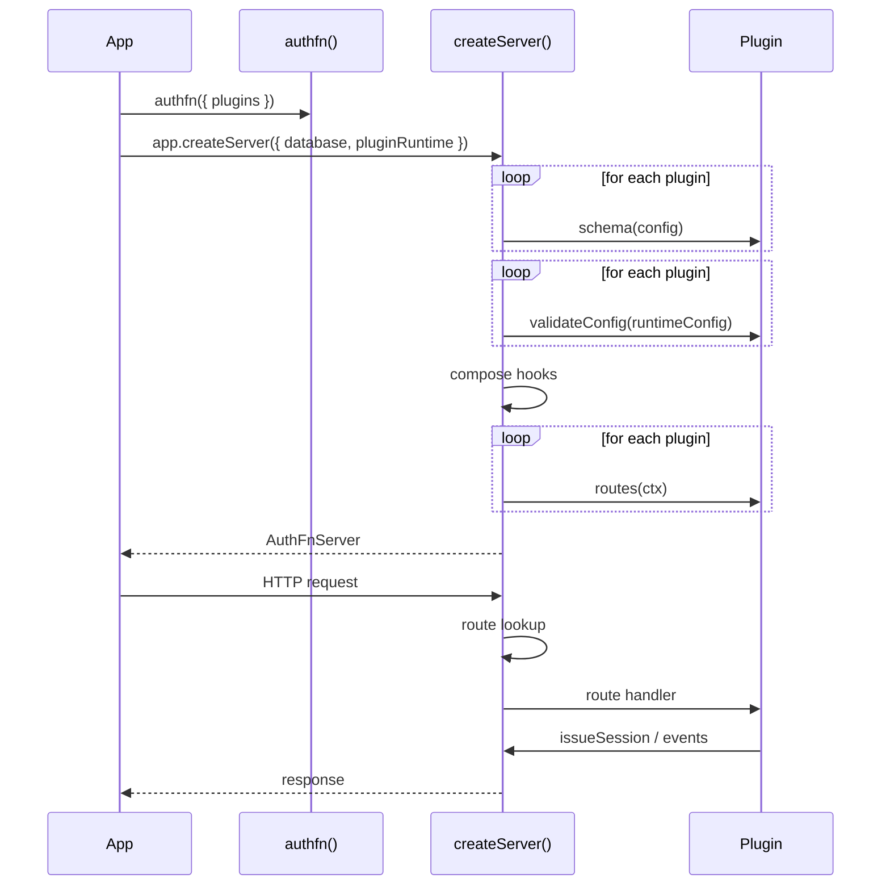

# Plugins

Every sign-in method in authfn is a plugin. So is every cross-cutting capability: API keys, two-factor auth, multi-region routing, native handoff. The kernel itself only owns the session manager, cookie/CSRF policy, runtime resolver, observability sink, and OpenAPI generator. Plugins contribute everything else.

The bundled plugins are:

| Plugin | Factory | What it adds |
| --- | --- | --- |
| Password | `authFnPasswordPlugin` | `/auth/sign-up/password`, `/auth/sign-in/password`, password-reset OTP, schema, events. |
| Email OTP | `authFnEmailOtpPlugin` | `/auth/otp/*`, OTP table, delivery contract. |
| Social OAuth | `authFnSocialOAuthPlugin` | `/auth/oauth/:provider/*`, native Apple flow, OAuth state table. |
| API keys | `authFnApiKeyPlugin` | `/auth/api-keys/*`, API key table, bearer auth. |
| Two-factor | `authFnTwoFactorPlugin` | `/auth/2fa/*`, TOTP enrollment + recovery codes. |
| Multi-region | `authFnMultiRegionPlugin` | Region lookup, runtime overlays, mismatch redirects. |
| Native handoff | `authFnNativeHandoffPlugin` | Web↔native session handoff codes. |

## Plugin shape

```ts
interface AuthFnPlugin {
  name: string;
  schema?(config: AuthFnConfig): TableSchema[];
  routes?(ctx: AuthFnPluginRuntimeContext): Route[];
  hooks?: Partial<AuthFnHooks>;
  hookFailurePolicy?: Partial<Record<keyof AuthFnHooks, 'observe' | 'fail'>>;
  validateConfig?(config: AuthFnConfig): void;
}
```

A plugin contributes:

- **`name`** — required, unique. Used for observability and conflict detection.
- **`schema`** — optional, returns the tables the plugin needs in the underlying database.
- **`routes`** — optional, returns HTTP routes mounted under the kernel's `basePath`.
- **`hooks`** — optional, an object with one or more of the [`AuthFnHooks`](./hooks) callbacks.
- **`hookFailurePolicy`** — optional, declares whether a hook throwing should fail the request (`'fail'`) or just emit `authfn.plugin.failed` and continue (`'observe'`).
- **`validateConfig`** — optional, throws `AuthFnConfigError` at construction if config is bad.

Plugins are *passive descriptors*. The kernel composes them; nothing in a plugin runs at module-import time.

## Lifecycle



The kernel composes `schema(config)` before it assembles the runtime config.
After the database is wrapped with that schema, it runs `validateConfig` across
the plugins and then registers hooks and `routes(ctx)`. If any
`validateConfig` throws, the entire **server** refuses to construct.

## Ordering

Plugin order matters in two specific cases:

1. **Hook precedence.** Hooks run in plugin order. If two plugins register `beforeUserCreate`, the first wins; if the first one returns a value, the second sees the modified input.
2. **Route precedence.** Two plugins cannot register the same route. Conflicts throw at construction.

For everything else (schema, observability), order is irrelevant.

## Disabling and enabling

Plugins are opt-in. To disable email OTP, leave `authFnEmailOtpPlugin()` out of the `plugins` array — the routes, the schema tables, and the OpenAPI surface all disappear. There's no `disabled: true` flag.

This means your enabled-plugin set is your deployment's surface area. Test environments and production environments can configure different plugin sets without code changes elsewhere.

## Configuration

Each plugin takes a config object specific to its concern. Schema and policy stay on the factory; secrets and delivery go to `createServer({ pluginRuntime })`:

```ts
authFnPasswordPlugin({
  requireEmailVerifiedForSignIn: true,
  compromisedPasswordChecker: hibpChecker,
});

authApp.createServer({
  database,
  pluginRuntime: {
    emailOtp: {
      delivery: { send: yourSendFn },
      challengeTtlSeconds: 600,
    },
    socialOAuth: {
      providers: { google, apple, github },
    },
    twoFactor: {
      recoveryCodeCount: 10,
      encryptionKeyResolver,
    },
  },
});
```

The full config surface for each plugin is documented under [Plugins](../plugins).

## Schema

Plugins describe their tables through `schema(config)`. The kernel composes them with the kernel's own (`authfn_users`, `authfn_sessions`) and exposes the unified set via `auth.getSchema()`. The Superfunctions CLI reads `auth.getSchema()` to generate migrations:

```bash
npx @superfunctions/cli generate-migration
```

Disabling a plugin removes its tables from `getSchema()`. Existing tables on a database are not auto-dropped — you'll want a manual migration if you remove a plugin.

## Authoring a custom plugin

A custom plugin is just an object that satisfies `AuthFnPlugin`. The simplest possible plugin:

```ts
import type { AuthFnPlugin } from 'authfn';

export function pingPlugin(): AuthFnPlugin {
  return {
    name: 'ping',
    routes: () => [{
      method: 'GET',
      path: '/ping',
      handler: async () => ({
        status: 200,
        json: { ok: true, data: { pong: true }, requestId: '' },
      }),
    }],
  };
}
```

Plugins typically:

- declare schema tables and read/write them via the `config.database` adapter,
- register hooks for cross-plugin coordination,
- emit observability events,
- throw `AuthFn*Error` for failures so the kernel converts them to envelopes.

Best practices:

- **Don't reach into kernel internals.** Use `config.database`, `config.observability.emit`, and the kernel-issued runtime/cookie helpers passed through `ctx`.
- **Throw typed errors.** `AuthFnError` subclasses map to envelopes for free. Untyped throws become `AUTHFN_INTERNAL_ERROR`.
- **Be deterministic in routes.** Routes are pure descriptors. Don't open files, start timers, or talk to outside services at registration; do it inside the route handler.

The full authoring guide is at [Plugins → Authoring custom plugins](../plugins/authoring).

## Hook failure policy

By default, if a plugin's hook throws, the request fails with `AUTHFN_PLUGIN_ABORTED`. Some hooks are non-essential — analytics, sync to a CRM, push notifications. For those, set `'observe'`:

```ts
{
  name: 'crm-sync',
  hooks: {
    afterUserCreate(ctx, user) { /* … */ },
  },
  hookFailurePolicy: {
    afterUserCreate: 'observe',  // emit authfn.plugin.failed but don't fail the request
  },
}
```

`'observe'` policies emit an `authfn.plugin.failed` event with `pluginName`, `hookName`, and the error payload (redacted) for your audit pipeline.

## Validation

`schema(config)` is composed first. Once the runtime config exists,
`validateConfig(config)` runs for every plugin before hooks are composed or any
route factory runs. Use it to fail fast on missing OAuth client IDs, malformed
delivery providers, or impossible parameter combinations. Throw
`AuthFnConfigError(message, details)`; the kernel surfaces it with
`AUTHFN_CONFIG_INVALID`.

## Related

- [Hooks](./hooks) — hook surface and ordering.
- [Plugins](../plugins) — full reference for every bundled plugin.
- [Plugins → Authoring](../plugins/authoring) — authoring guide for custom plugins.
- [Errors](./errors) — error classes you can throw.
