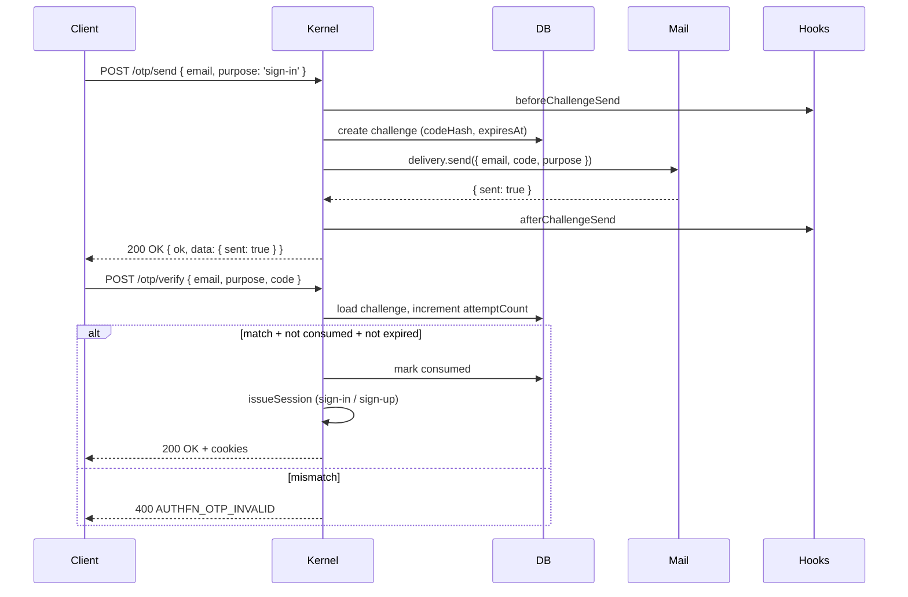

# Email OTP plugin

The email-OTP plugin generates short-lived one-time codes and hands them to a delivery provider you supply. The same plugin powers four purposes:

- `verify-email` — confirm a user's email address.
- `sign-in` — magic-link / OTP-only sign-in.
- `sign-up` — create an account on first OTP send.
- `reset-password` — used by the password plugin's reset flow.

```ts
import { authFnEmailOtpPlugin } from '@authfn/core';

authFnEmailOtpPlugin({
  delivery: {
    async send({ email, code, purpose, challengeId, metadata }) {
      await yourMailer.send({
        to: email,
        subject: `Your code: ${code}`,
        body: `Code: ${code} (purpose: ${purpose})`,
      });
      return { sent: true, metadata: { providerId: 'mailer-1' } };
    },
  },
  challengeTtlSeconds: 600,
  maxAttempts: 5,
});
```

## Configuration

| Option | Default | Notes |
| --- | --- | --- |
| `delivery` | required | The mail provider — see below. |
| `codeGenerator` | 6-digit numeric | Function that returns the OTP. Override for vanity codes / longer alphabets. |
| `now` | `() => new Date()` | Clock injection (for tests). |
| `challengeTtlSeconds` | `600` | OTP lifetime. |
| `maxAttempts` | `5` | Verification attempts per challenge before invalidation. |

### Delivery provider

```ts
interface AuthFnDeliveryProvider {
  send(input: AuthFnDeliveryRequest): Promise<AuthFnDeliveryResult> | AuthFnDeliveryResult;
  emit?(event: AuthFnOtpChallengeLifecycleEvent): Promise<void> | void;
}

interface AuthFnDeliveryRequest {
  channel: 'email';
  challengeId: string;
  purpose: 'verify-email' | 'sign-in' | 'sign-up' | 'reset-password';
  email: string;
  code: string;
  metadata?: Record<string, unknown>;
}

interface AuthFnDeliveryResult {
  sent: boolean;
  metadata?: Record<string, unknown>;
}
```

If `send` throws, the kernel surfaces `AUTHFN_DELIVERY_FAILED` (HTTP 503, retryable).

The optional `emit` is a per-provider observability hook — it fires when the kernel records `authfn.otp.sent` and `authfn.otp.verified`. Useful for vendor-specific instrumentation without adding a global observability sink.

## Routes

| Method | Path | Operation ID | Notes |
| --- | --- | --- | --- |
| `POST` | `/auth/otp/send` | `sendEmailOtp` | Send an OTP for the given purpose. Body: `{ email, purpose }`. |
| `POST` | `/auth/otp/verify` | `verifyEmailOtp` | Verify and consume an OTP. Body: `{ email, purpose, code, sessionMode? }`. |

For `purpose: 'sign-in' | 'sign-up'`, a successful verify also issues a session (or links into an existing user — see [Account linking](../core-concepts/account-linking)).

## Schema

| Table | Purpose |
| --- | --- |
| `authfn_otp_challenges` | One row per active challenge: `{ id, purpose, email, codeHash, attemptCount, expiresAt, consumedAt, deliveryMetadata, createdAt, updatedAt }`. |

The plaintext code is never stored. Verification compares `codeHash` against the supplied code.

## Lifecycle



## Errors

| Code | When |
| --- | --- |
| `AUTHFN_VALIDATION_ERROR` | Missing email/purpose. |
| `AUTHFN_DELIVERY_FAILED` | `delivery.send` threw or returned `sent: false`. |
| `AUTHFN_OTP_INVALID` | Code doesn't match. |
| `AUTHFN_OTP_EXPIRED` | Past `expiresAt`. |
| `AUTHFN_OTP_REPLAYED` | Already consumed. |
| `AUTHFN_CONFLICT` | Sign-up but the email already exists (when `otpSignUpExistingUser` is `false`). |
| `AUTHFN_REGION_MISMATCH` | Multi-region: email is in another region. |

## Events

- `authfn.otp.sent` — challenge created and handed to delivery.
- `authfn.otp.verified` — challenge verified.
- `authfn.user.created` — first-time sign-up via OTP.
- `authfn.session.issued` — sign-in / sign-up succeeded.
- `authfn.account_linked` — OTP sign-up linked into an existing user (with `otpSignUpExistingUser: true`).
- `authfn.otp.signup.rollback_failed` — rollback after a failed mid-write sign-up.

## Account linking with OTP

Set `accountLinking.otpSignUpExistingUser: true` to make OTP sign-up for an existing email succeed as a sign-in. The OTP itself is proof of email control, so this is safe for almost all consumer apps. See [Concepts → Account linking](../core-concepts/account-linking).

## Email anti-enumeration

`POST /otp/send` returns `200 OK { sent: true }` regardless of whether the email exists. The OTP is sent and recorded as a challenge. If the email doesn't correspond to a real user, verification will still happen — but no session will be issued; the kernel returns the appropriate `AUTHFN_*` error.

## Code generation

The default `codeGenerator` produces a 6-digit numeric code. For longer codes or alphabets, supply your own:

```ts
import { randomBytes } from 'node:crypto';

authFnEmailOtpPlugin({
  delivery,
  codeGenerator: () => {
    const bytes = randomBytes(4);
    return [...bytes].map((b) => 'ABCDEFGHIJKLMNPQRSTUVWXYZ23456789'[b % 32]).join('');
  },
});
```

Use a high-entropy generator. The kernel does not enforce code-shape policy — you do.

## Magic-link sign-in pattern

If you'd rather show users a clickable link than a code, do *not* sign-in directly from a `GET` handler — that's CSRF-fragile. Instead:

- Send the link `https://app.example.com/sign-in/click?email=...&code=...`.
- The link's page reads the params and POSTs `/auth/otp/verify`.
- The browser hits an authenticated page on success.

The OTP is single-use and short-lived, so this gives you the magic-link UX with the security of double-submit POST.

## Related

- [Core concepts → Account linking](../core-concepts/account-linking)
- [Recipes → Magic link sign-in](../recipes/magic-link)
- [Recipes → Email verification](../recipes/email-verification)
- [Adapters → Mail](../adapters/mail) — Resend / Postmark / SendGrid / SES drop-ins.
- [Examples → otp-recovery](../examples/otp-recovery)
