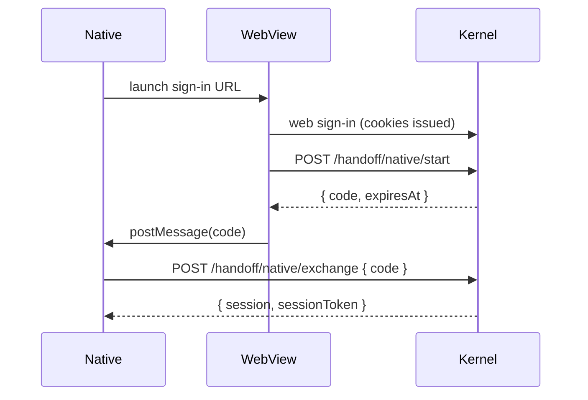

# Native handoff plugin

`authFnNativeHandoffPlugin` is the bridge between **a sign-in that happened in a web view (or a system browser)** and **a native app that needs a bearer credential**. Use it when:

- Your iOS / Android app wraps a web sign-in (Apple HIG-compliant `ASWebAuthenticationSession`, Custom Tabs).
- Your desktop electron / tauri app wraps a web sign-in.
- Your CLI opens a system browser to authenticate, then exchanges a code on a local socket.

```ts
import { authFnNativeHandoffPlugin } from '@authfn/core';

authFnNativeHandoffPlugin({
  codeTtlSeconds: 300,   // 5 minutes
});
```

## Configuration

| Option | Default | Notes |
| --- | --- | --- |
| `codeTtlSeconds` | `300` | Lifetime of a handoff code before it expires. |
| `now` | `() => new Date()` | Clock injection. |

## Routes

| Method | Path | Operation ID | Notes |
| --- | --- | --- | --- |
| `POST` | `/auth/handoff/native/start` | `startNativeHandoff` | Issue a handoff code for the current session. |
| `POST` | `/auth/handoff/native/exchange` | `exchangeNativeHandoff` | Exchange the code for a session (bearer or cookie). |
| `POST` | `/auth/handoff/web/start` | `startWebHandoff` | Inverse: native → web. Issues a code the web side can exchange. |
| `GET` | `/auth/handoff/web/consume` | `consumeWebHandoff` | Web side hits this to consume the code. |

## Schema

| Table | Purpose |
| --- | --- |
| `authfn_handoff_codes` | `{ id, codeHash, sourceSessionId, target, regionId, userId, expiresAt, consumedAt, createdAt, metadata }`. |

Codes are hashed at rest; the plaintext is shown once at issuance.

## Native handoff (web → native) flow



The web view does the hard work (cookies, CSRF, OAuth state), then mints a one-time code. The native app exchanges that code for a bearer credential it stores in Keychain.

## Bridging through Apple's Web Authentication Session

`ASWebAuthenticationSession` returns control to your app on a callback URL. Configure your social-OAuth flow with `defaultHandoffMode: 'session-token'`, and the kernel will redirect to your callback URL with a handoff code embedded:

```
myapp://signed-in?code=<handoff-code>
```

Your iOS code parses the URL, calls `exchangeNativeHandoff`, and lands a bearer credential.

## Bridging through `WKScriptMessageHandler`

When you host a `WKWebView` inside your iOS app, install `AuthFnWebViewBridgeHost` to receive `postMessage` from the web side. The bridge calls `exchangeNativeHandoff` for you and surfaces a typed credential:

```swift
import AuthFnWebViewBridgeHost

let bridge = AuthFnWebViewBridge(client: authFnClient)
bridge.attach(to: webView)
```

## Web handoff (native → web)

Less common, but useful when a native app wants to deep-link into a web page that should be authenticated as the native user. Native side calls `startWebHandoff`; the URL it hands to the web side carries `?code=<handoff-code>`. The web page calls `consumeWebHandoff`, sets cookies, and continues.

## Errors

| Code | When |
| --- | --- |
| `AUTHFN_VALIDATION_ERROR` | Missing fields. |
| `AUTHFN_NOT_FOUND` | Code is unknown. |
| `AUTHFN_OTP_EXPIRED` | Code is past `expiresAt`. (We reuse the OTP-expired code class because semantically the same.) |
| `AUTHFN_OTP_REPLAYED` | Code already consumed. |
| `AUTHFN_REGION_MISMATCH` | The code's region doesn't match this authority. |

## Events

- `authfn.handoff.started`
- `authfn.handoff.exchanged`
- `authfn.handoff.failed`

## Multi-region

Handoff codes carry their `regionId`. If a code created on `us-east-1` is exchanged on `eu-west-1`, the kernel returns `AUTHFN_REGION_MISMATCH` with a `redirectTo` to the right authority. This means a native app holding a code can survive being routed to the wrong region by a load balancer — it'll just retry against the right one.

## Security

- Codes are single-use, short-lived, and bound to the issuing session.
- Codes hashed at rest with the same algorithm used for session tokens.
- Codes don't carry the user's identity in the plaintext — only the consumer of `exchangeNativeHandoff` sees the resolved session.
- Replay returns `AUTHFN_OTP_REPLAYED`.

## Related

- [SDKs → Swift](../sdk/swift) — `AuthFnSwift` exposes `exchangeNativeHandoff` and `startNativeHandoff`.
- [Plugins → Social OAuth](./social-oauth) — `defaultHandoffMode: 'session-token'`.
- [Recipes → Native mobile handoff](../recipes/native-mobile-handoff) — end-to-end walkthrough.
