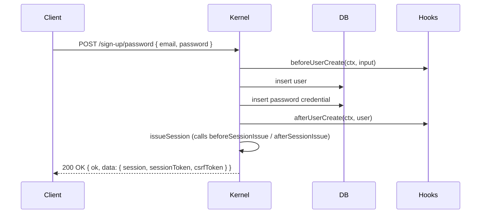
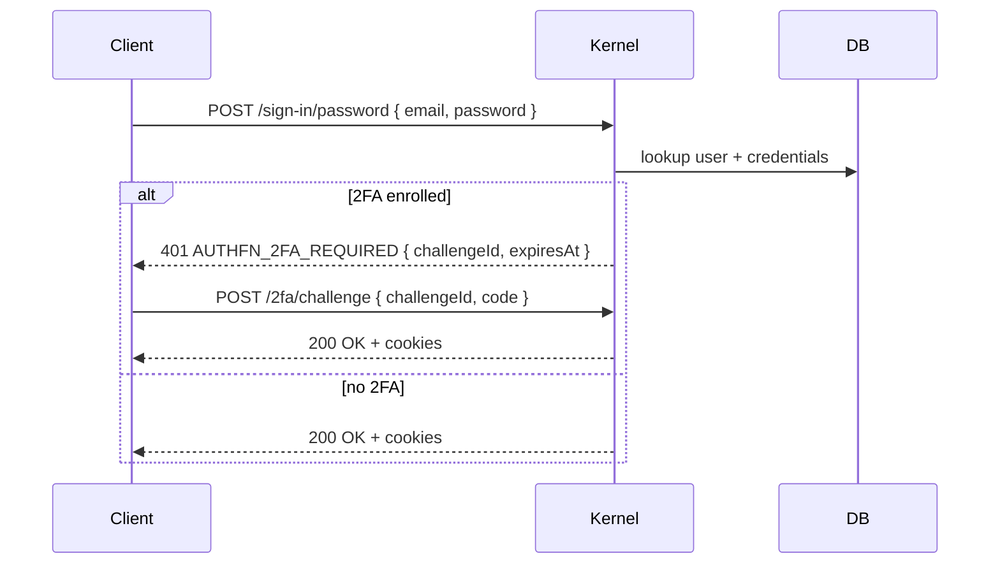
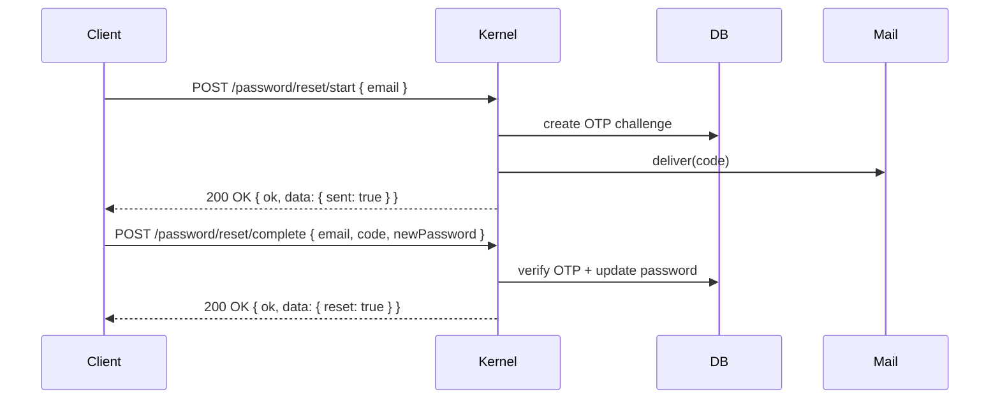

# Password plugin

The password plugin turns an `AuthFn` instance into something a user can sign up to with `{ email, password }`. It also wires the password-reset flow through the email-OTP plugin.

```ts
import { authFnPasswordPlugin } from '@authfn/core';

createAuthFn({
  // ...
  plugins: [authFnPasswordPlugin()],
});
```

## Configuration

```ts
authFnPasswordPlugin({
  compromisedPasswordChecker: hibpChecker,
  requireEmailVerifiedForSignIn: false,
  otp: {                                // password-reset OTP overrides
    delivery: yourDelivery,             // optional; falls back to email-otp's delivery
    challengeTtlSeconds: 600,
    maxAttempts: 5,
  },
});
```

| Option | Default | Notes |
| --- | --- | --- |
| `compromisedPasswordChecker` | `undefined` | A function that checks the password against breach data (e.g. HIBP). Called on sign-up and reset. Throws `AuthFnValidationError` if compromised. |
| `requireEmailVerifiedForSignIn` | `false` | If `true`, sign-in fails with `AUTHFN_EMAIL_NOT_VERIFIED` until the user verifies their email. |
| `otp.delivery` | falls back to `authFnEmailOtpPlugin`'s delivery | Per-flow OTP delivery for password resets. |
| `otp.challengeTtlSeconds` | `600` (10 min) | TTL for password-reset OTPs. |
| `otp.maxAttempts` | `5` | Maximum verification attempts per challenge. |

## Routes

| Method | Path | Operation ID | Notes |
| --- | --- | --- | --- |
| `POST` | `/auth/sign-up/password` | `signUpWithPassword` | Create a user and issue a session. Body: `{ email, password, profile?, sessionMode? }`. |
| `POST` | `/auth/sign-in/password` | `signInWithPassword` | Sign in. May respond with `AUTHFN_2FA_REQUIRED` if 2FA is enrolled. |
| `POST` | `/auth/password/reset/start` | `startPasswordReset` | Send a password-reset OTP. Always returns `200 OK` regardless of email existence (anti-enumeration). |
| `POST` | `/auth/password/reset/complete` | `completePasswordReset` | Verify the OTP and set a new password. |

All routes return the standard envelope. See [API reference](../api) for full schemas.

## Schema

| Table | Purpose |
| --- | --- |
| `authfn_password_credentials` | Stores `{ id, userId, passwordHash, createdAt, updatedAt }`. One row per user; password hashes only — never the plaintext. |

## Hashing

Passwords are hashed with **argon2id** with vetted parameters (the kernel uses a default cost suitable for modern hardware; you can override via the plugin's `passwordHashing` config if needed).

## Sign-up flow



## Sign-in flow



## Password reset flow



## Account-linking interactions

When a user is already authenticated and `accountLinking.passwordForAuthenticatedUser` is `true`, calling `POST /auth/sign-up/password` with the user's own email **adds** a password credential to the existing account instead of creating a new user. See [Concepts → Account linking](../core-concepts/account-linking).

## Errors

| Code | When |
| --- | --- |
| `AUTHFN_VALIDATION_ERROR` | Missing email/password, password fails policy, or `compromisedPasswordChecker` returned `compromised: true`. |
| `AUTHFN_CONFLICT` | Email already in use (and account linking didn't apply). |
| `AUTHFN_INVALID_CREDENTIALS` | Sign-in: wrong email or password. |
| `AUTHFN_EMAIL_NOT_VERIFIED` | Sign-in blocked because `requireEmailVerifiedForSignIn` is on. |
| `AUTHFN_2FA_REQUIRED` | Sign-in succeeded for primary; 2FA challenge needs to complete. |
| `AUTHFN_REGION_MISMATCH` | Multi-region: this email lives in another region. |
| `AUTHFN_OTP_INVALID` / `AUTHFN_OTP_EXPIRED` / `AUTHFN_OTP_REPLAYED` | Password reset OTP failures. |

## Events

- `authfn.user.created` — sign-up succeeded.
- `authfn.session.issued` — session issued (sign-up or sign-in).
- `authfn.account_linked` — sign-up linked into an existing account.
- `authfn.password.signup.rollback_failed` — sign-up failed mid-write and rollback was incomplete.
- `authfn.session.revoked` — covered by sign-out paths, not by this plugin specifically.

## Compromised password check

`compromisedPasswordChecker` lets you wire HIBP, your own breach corpus, or a deny-list:

```ts
import type { AuthFnPasswordCompromiseChecker } from '@authfn/core';

const hibpChecker: AuthFnPasswordCompromiseChecker = async ({ password }) => {
  const sha1 = await sha1Hex(password);
  const prefix = sha1.slice(0, 5).toUpperCase();
  const suffix = sha1.slice(5).toUpperCase();
  const text = await fetch(`https://api.pwnedpasswords.com/range/${prefix}`).then((r) => r.text());
  for (const line of text.split('\n')) {
    const [s, count] = line.trim().split(':');
    if (s === suffix) return { compromised: true, count: Number(count) };
  }
  return false;
};

authFnPasswordPlugin({ compromisedPasswordChecker: hibpChecker });
```

If the checker returns `{ compromised: true }`, the kernel throws `AuthFnValidationError('password is compromised', { ... })`. Display a "this password has appeared in a data breach" hint in your UI.

## Example client usage

```ts
const session = await client.signUpWithPassword({
  email: 'ada@example.com',
  password: 'correct horse battery staple',
});

const sameSession = await client.signInWithPassword({
  email: 'ada@example.com',
  password: 'correct horse battery staple',
});

await client.startPasswordReset({ email: 'ada@example.com' });
await client.completePasswordReset({
  email: 'ada@example.com',
  code: '123456',
  newPassword: 'a different one',
});
```

## Related

- [Core concepts → Account linking](../core-concepts/account-linking)
- [Plugins → Email OTP](./email-otp)
- [Plugins → Two-factor](./two-factor)
- [Recipes → Password reset](../recipes/password-reset)
- [Examples → password-sessions](../examples/password-sessions)
