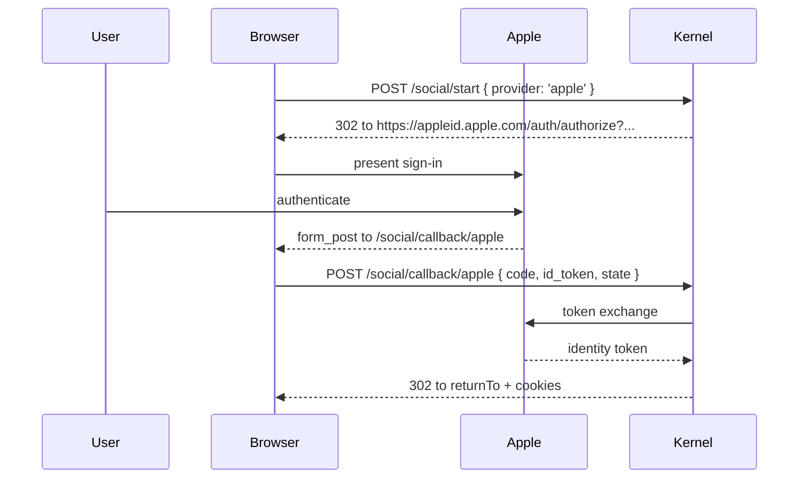
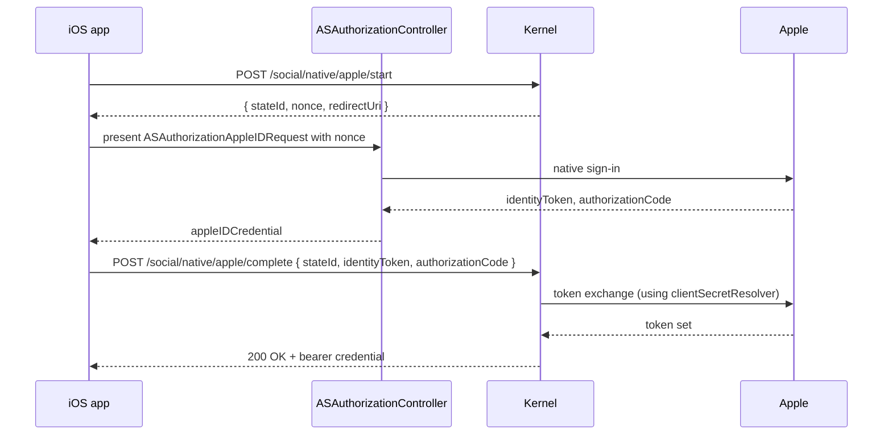

# Apple

Sign in with Apple has a few quirks compared to other OAuth providers:

- Apple's **client secret is itself a JWT**, signed with the private key Apple gave you. Most servers regenerate it periodically; authfn lets you supply a generator function so you don't bake an expiring JWT into config.
- Apple's callback uses **`response_mode=form_post`** — the response is `POST`ed to the redirect URI as a form, not appended as query parameters. authfn handles this transparently with the `POST /auth/social/callback/apple` route.
- Apple **only sends the user's name on the very first authorization**. authfn captures it on the initial sign-up and never expects it again.
- Apple supports a **native flow** on iOS and macOS via `ASAuthorizationAppleIDProvider`. authfn integrates with it through `/auth/social/native/apple/start` and `/auth/social/native/apple/complete`.

## Setup

1. Create an App ID + Service ID at [Apple Developer → Certificates, IDs & Profiles](https://developer.apple.com/account/resources/identifiers/list).
2. Create a Sign in with Apple key (download the `.p8`).
3. In your config, supply the **team id**, the **key id**, the **Service ID** (this is the OAuth `client_id` from authfn's perspective), and the **redirect URI** registered in the Apple console.

## Configuration

```ts
import { createAppleClientSecret } from './apple-secret.js';   // your generator

authFnSocialOAuthPlugin({
  providers: {
    apple: {
      clientId: process.env.APPLE_SERVICE_ID!,                    // your Services Id
      clientSecretResolver: async () => createAppleClientSecret({
        teamId: process.env.APPLE_TEAM_ID!,
        keyId: process.env.APPLE_KEY_ID!,
        privateKeyPem: process.env.APPLE_PRIVATE_KEY!,
        clientId: process.env.APPLE_SERVICE_ID!,
      }),
      allowlistedRedirectUris: ['https://app.example.com/auth/social/callback/apple'],
      nativeClientIds: ['com.example.app'],                       // bundle ids for native flow
    },
  },
});
```

`clientSecretResolver` is preferred over a static `clientSecret` because Apple secrets expire (≤ 6 months). The resolver is called per-request; cache the JWT for ≤ 1 hour and reuse.

## Web flow



The kernel verifies the Apple identity token against `https://appleid.apple.com/auth/keys` (cached JWKS). The token's `sub` becomes `providerAccountId`.

## Native iOS / macOS flow

Native Sign in with Apple on iOS and macOS gives the user a system sheet — no Safari, no fragment. The flow is:



`nativeClientIds` should include the bundle ids that your app may sign in from. Multiple bundle ids are supported (development vs production).

The `AuthFnSwift` SDK encapsulates this flow — see [SDKs → Swift](../sdk/swift).

## First-time-only name

Apple sends the user's name on the very first authorization only — subsequent flows return only the `sub` and email. The kernel persists the name on `authfn_users.metadata` if you provide one in the initial request body (`profile.name`). The native iOS API will give you a `fullName` you should pass through.

## Email relay

Apple optionally relays mail through a per-app email alias (e.g. `xxxxx@privaterelay.appleid.com`). authfn treats relay emails like any other email — they just won't match a "real" inbox. Display names should not assume a particular email format.

## Errors specific to Apple

- `invalid_client` from Apple typically means an expired or wrong client-secret JWT. Verify your `clientSecretResolver` is producing fresh JWTs.
- Identity token verification failures bubble up as `AUTHFN_OAUTH_CALLBACK_INVALID` with `details.reason = 'identity_token_invalid'`.
- Native start without a registered `nativeClientIds` returns `AUTHFN_OAUTH_PROVIDER_UNSUPPORTED`.
