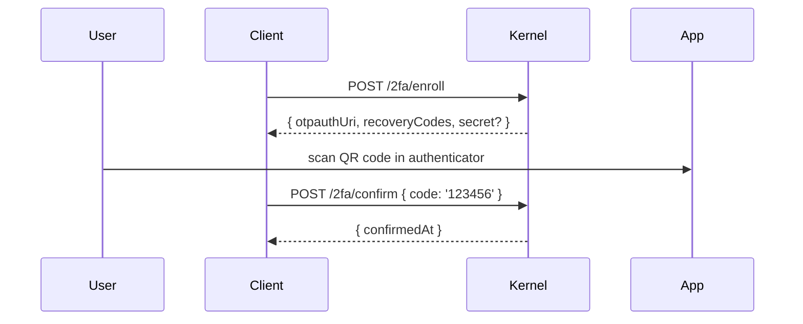
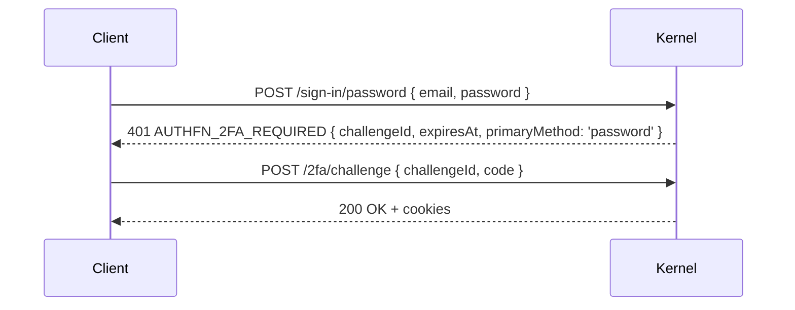

# Two-factor plugin

`authFnTwoFactorPlugin` adds TOTP-based two-factor authentication on top of any primary sign-in method (password, OTP, OAuth). Once a user enrolls and confirms, every subsequent sign-in returns `AUTHFN_2FA_REQUIRED` first; the user provides a code from their authenticator app, and only then does the kernel issue a session.

```ts
import { authFnTwoFactorPlugin } from '@authfn/core';

authFnTwoFactorPlugin({
  issuer: 'AcmeApp',
  digits: 6,
  periodSeconds: 30,
  window: 1,
  recoveryCodeCount: 10,
  encryptionKeyResolver: async () => loadKeyFromVault(),
});
```

## Configuration

| Option | Default | Notes |
| --- | --- | --- |
| `issuer` | `'authfn'` | The "issuer" string in the otpauth URI. Shown in authenticator apps. |
| `digits` | `6` | TOTP digits. |
| `periodSeconds` | `30` | TOTP period. |
| `window` | `1` | Skew tolerance — codes from the previous, current, and next window are accepted. |
| `challengeTtlSeconds` | `300` (5 min) | Lifetime of a challenge after primary sign-in. |
| `recoveryCodeCount` | `10` | Number of recovery codes generated at enrollment. |
| `encryptionKeyRef` | `'default'` | Identifier passed to your `encryptionKeyResolver`. |
| `encryptionKeyResolver` | required for production | Returns a `Buffer` used to encrypt the TOTP secret at rest. |

The TOTP secret is encrypted at rest using AES-256-GCM with the key returned by `encryptionKeyResolver`. **Do not** hardcode keys; load them from a KMS, Vault, AWS Secrets Manager, or equivalent. Rotating the key requires re-encrypting existing enrollments — a recipe is in [Recipes → Rotating 2FA encryption](../recipes/rotate-2fa-encryption).

## Routes

| Method | Path | Operation ID | Notes |
| --- | --- | --- | --- |
| `POST` | `/auth/2fa/enroll` | `enrollTwoFactor` | Generate a TOTP secret + recovery codes for the current user. |
| `POST` | `/auth/2fa/confirm` | `confirmTwoFactor` | Confirm enrollment by submitting a valid TOTP code. |
| `POST` | `/auth/2fa/challenge` | `completeTwoFactorChallenge` | Complete the pending challenge from a primary sign-in. |
| `POST` | `/auth/2fa/disable` | `disableTwoFactor` | Disable 2FA. Requires a valid TOTP or recovery code. |

## Schema

| Table | Purpose |
| --- | --- |
| `authfn_two_factor_enrollments` | `{ id, userId, secretEncrypted, lastUsedCounter, confirmedAt, createdAt, updatedAt }`. |
| `authfn_two_factor_recovery_codes` | `{ id, enrollmentId, codeHash, usedAt, createdAt }` — one row per code. |
| `authfn_two_factor_challenges` | `{ id, userId, primaryMethod, expiresAt, consumedAt, createdAt, updatedAt }` — one row per pending challenge. |

## Enrollment flow



`recoveryCodes` are returned **once** at enrollment. Show them to the user and tell them to save them. The kernel only stores their hashes.

## Sign-in with 2FA



Within `challengeTtlSeconds`, the user must submit either a TOTP code or a recovery code. Recovery codes are single-use; a successful use marks the row as `usedAt: <now>`.

## Disabling 2FA

`POST /2fa/disable` requires a fresh TOTP or recovery code in the body. The kernel revokes all of the user's 2FA enrollments and recovery codes in one transaction.

## Challenge replay protection

Each TOTP code is checked against `lastUsedCounter` — codes for windows ≤ that counter are rejected. This prevents replaying the same code twice within its window.

## Recovery code regeneration

After a recovery code is used, you should prompt the user to regenerate the set:

```ts
// Re-enroll keeps the user's secret but issues fresh recovery codes.
await client.enrollTwoFactor({ regenerateRecoveryCodes: true });
```

The recipe in [Recipes → Adding 2FA](../recipes/adding-2fa) walks through both the enrollment and the regeneration flows.

## Errors

| Code | When |
| --- | --- |
| `AUTHFN_2FA_INVALID_CODE` | Submitted code is wrong (TOTP or recovery). |
| `AUTHFN_2FA_REQUIRED` | Sign-in succeeded for the primary method; 2FA challenge needs to complete. |
| `AUTHFN_NOT_FOUND` | `disable`/`challenge` for a non-enrolled user. |
| `AUTHFN_VALIDATION_ERROR` | Missing fields, malformed code. |

## Events

- `authfn.2fa.enabled` — confirmation succeeded.
- `authfn.2fa.challenged` — challenge issued (carries `primaryMethod`).
- `authfn.session.issued` — session issued post-challenge.

## Encryption rotation

To rotate `encryptionKeyRef`:

1. Add the new key to your secrets store.
2. Update `encryptionKeyResolver` to return the new key for the new ref.
3. Run a one-off migration: decrypt with the old key (look up by `encryptionKeyRef`), re-encrypt with the new key, update the row.

The recipe at [Recipes → Rotating 2FA encryption](../recipes/rotate-2fa-encryption) ships a script you can adapt.

## Related

- [Plugins → Password](./password) — primary auth method that 2FA builds on.
- [Plugins → Email OTP](./email-otp) — OTP-only sign-up + 2FA is a clean flow.
- [Recipes → Adding 2FA](../recipes/adding-2fa)
- [Examples → account-settings](../examples/account-settings) — 2FA enrollment UI.
