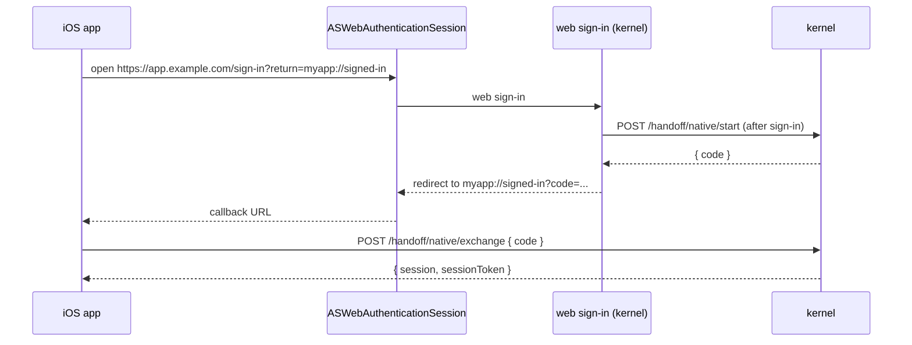

# Native mobile handoff

## Goal

User taps "Sign in" in your iOS app, sees Apple's `ASWebAuthenticationSession` (or Android's Custom Tabs) with your web sign-in, and lands back in the app **with a bearer credential**, ready to call APIs.

## Plugins

- `authFnSocialOAuthPlugin` with `defaultHandoffMode: 'session-token'`.
- `authFnNativeHandoffPlugin`.

## Flow



## Server config

```ts
authFnSocialOAuthPlugin({
  providers: { google: { /* ... */ } },
  defaultHandoffMode: 'session-token',
});
authFnNativeHandoffPlugin();
```

## Web sign-in page

After successful sign-in, your web app calls:

```ts
const handoff = await client.startNativeHandoff();
if (handoff.ok) {
  window.location.href = `${returnTo}?code=${encodeURIComponent(handoff.data.code)}`;
}
```

`returnTo` is the app's custom URL scheme (`myapp://signed-in`).

## iOS exchange

```swift
let credential = try await client.exchangeNativeHandoff(
    code: handoffCode,
    accountBaseURL: configuration.baseURL,
    device: ["model": UIDevice.current.model]
)
// credential.session, credential.bearerToken
```

Store the bearer token in Keychain. Subsequent requests authenticate with `Authorization: Bearer <token>`.

## Multi-region

If the code was issued by a region different from the one the app first hits, the kernel returns `AUTHFN_REGION_MISMATCH` with `redirectTo`. The regional client retries on the right authority transparently.

## Related

- [Plugins → Native handoff](../plugins/native-handoff)
- [Plugins → Social OAuth → Apple](../plugins/social-oauth/apple)
- [SDKs → Swift](../sdk/swift)
