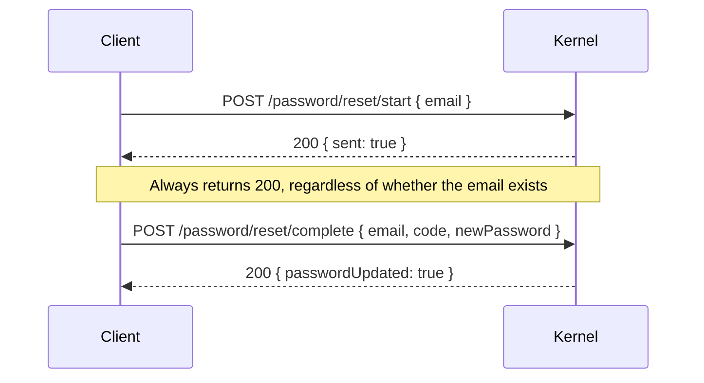

# Password reset

## Goal

Let a user reset their password if they forgot it. The kernel does this through a verify-email-style OTP.

## Plugins

- `authFnPasswordPlugin` (mounts `/password/reset/start` and `/password/reset/complete`).
- The OTP is delivered via the password plugin's own `otp` config, falling back to `authFnEmailOtpPlugin`'s `delivery` if not specified.

## Flow



## Code

```ts
await client.startPasswordReset({ email });
// User checks their inbox, comes back with a code:
await client.completePasswordReset({ email, code, newPassword });
```

## Anti-enumeration

`/password/reset/start` always returns `200 OK` — including for emails that don't exist. This means an attacker can't tell whether `bob@example.com` is a real user. The OTP is sent only when the email exists; for unknown emails, no email is sent.

## Compromised-password check

If you've configured `compromisedPasswordChecker` on `authFnPasswordPlugin`, it runs on `/password/reset/complete` too — preventing users from resetting *to* a known-compromised password.

## Related

- [Plugins → Password](../plugins/password)
- [Plugins → Email OTP](../plugins/email-otp)
