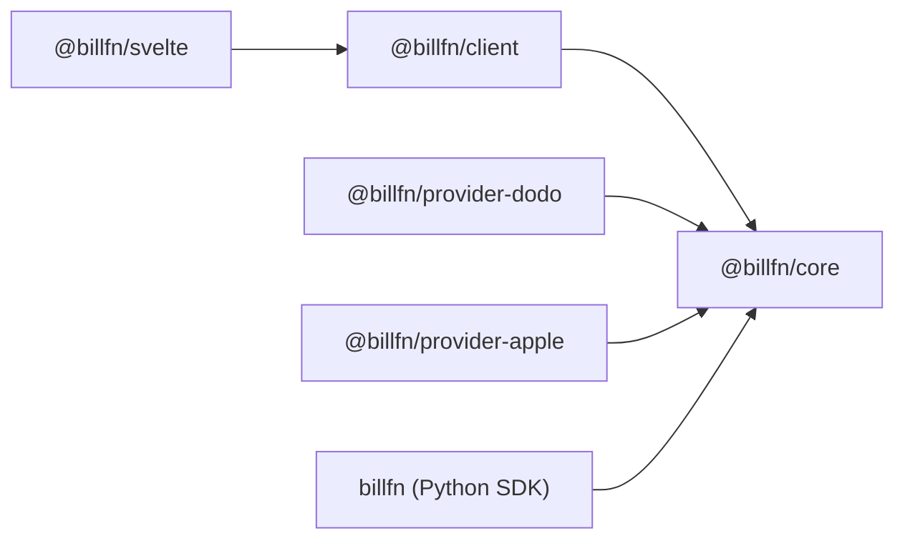
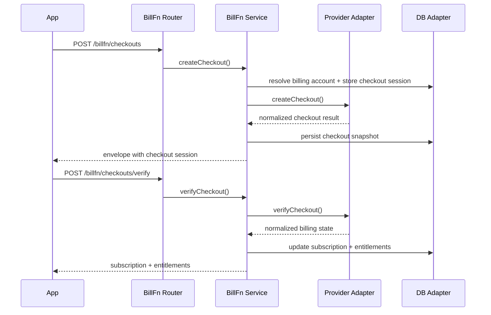

BillFn is designed as a self-hostable billing layer with a simple boundary:

- providers own payment-side facts
- BillFn owns normalized subscription, entitlement, usage, and webhook state

That gives downstream systems stable reads even when providers differ dramatically.

## Package Boundaries

The provider packages stay outside core so webhook quirks, receipt parsing, and provider SDK behavior do not leak into the billing domain.

## Core Data Flow

## Why Entitlements Sit in the Center

Subscriptions are not the best public integration surface. Most consumers actually need:

- `is this account active?`
- `does it have feature X?`
- `what storage quota is left?`

That is why BillFn projects provider activity into:

- `subscriptionProvider`
- `quotaProvider`
- `GET /entitlements`
- `GET /usage`

This is the seam that `authfn`, `filefn`, and future functions should depend on.

## Webhook and Restore Strategy

BillFn stores both a normalized read model and an event trail:

- `webhookReceipts` dedupe provider events by provider and provider event id
- `billingEvents` keep a durable internal timeline
- `checkoutSessions` and `subscriptions` help BillFn project provider activity back into the right billing account

Restore is intentionally ownership-sensitive. Phase 1 restore paths only succeed when the incoming provider reference can be linked back to the correct billing account instead of silently projecting a foreign purchase into the wrong account.

## Phase 1 Tradeoffs

Phase 1 is intentionally conservative:

- Apple cancellation is left to Apple-managed surfaces
- Apple webhook ingestion is not implemented
- only Dodo ingests server webhooks today
- Python mirrors the HTTP and schema surface, but it is not a second billing engine

Those constraints keep the domain model clean while leaving room for future provider packages.
