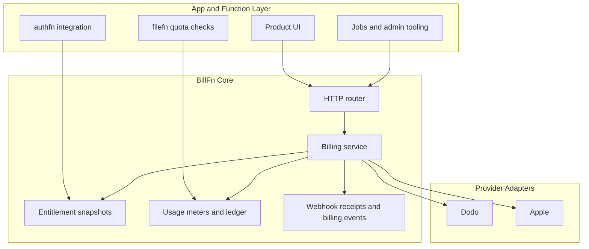

BillFn is a self-hostable billing infrastructure layer for product builders. It gives you billing accounts, checkout flows, subscription state, entitlement snapshots, usage metering, and webhook ingestion behind one normalized interface so your product can ask a simpler question: **what is this account allowed to do right now?**

Phase 2 currently ships:

| Package | Purpose |
| --- | --- |
| `@billfn/core` | Core billing domain, service, router, schema helpers, entitlement and quota providers |
| `@billfn/client` | Typed HTTP client for browser or server consumers |
| `@billfn/svelte` | Svelte context and entitlement store helpers |
| `@billfn/provider-dodo` | Dodo adapter for checkout, verification, sync, restore, refunds, change fallback, and webhooks |
| `@billfn/provider-apple` | Apple adapter for StoreKit verification, sync, restore, ASSN v2, notification history, and client-side purchase handoff |
| `@billfn/swift-bridge` | JavaScript bridge protocol for native-backed embedded web apps |
| `BillFnSwift` | Native Apple client, StoreKit helpers, and webview bridge host |
| `billfn` | Python SDK for sync and async HTTP access plus schema helpers |

## Entitlement-First Architecture

Providers remain the source of truth for money movement, but BillFn becomes the internal source of truth for entitlement state and usage enforcement.

This shape keeps application code away from provider-specific payloads. Downstream systems should read entitlements and quotas, not raw payment metadata.

## What BillFn Stores

BillFn’s schema is intentionally split between provider-facing facts and normalized internal state:

- `billingAccounts`
- `subscriptions`
- `checkoutSessions`
- `entitlementSnapshots`
- `usageMeters`
- `usageLedger`
- `webhookReceipts`
- `billingEvents`
- `refunds`
- `subscriptionChangeRequests`
- `reconciliationJobs`
- `reconciliationCursors`

These tables are documented in the [schema reference](/docs/reference/schema).

## Current Provider Scope

Current provider scope:

- Dodo supports checkout creation, checkout verification, subscription sync, cancellation, change fallback, refunds, restore, and webhook ingestion.
- Apple supports purchase handoff, verification, sync, restore, App Store Server Notifications v2, and notification history backfill.
- Apple server-side cancellation and revoke depend on Advanced Commerce eligibility.
- Apple lifecycle operations fall back to `manage-subscription` actions when Apple owns the interaction.
- Type-level names for `stripe`, `polar`, `google-play`, and `microsoft-store` exist, but production adapters for them are not included yet.

## Next Steps

- [Getting Started](/docs/getting-started)
- [Architecture](/docs/architecture)
- [Production readiness](/docs/production-readiness)
- [Server setup](/docs/server/setup)
- [TypeScript client](/docs/clients/typescript)
- [Swift client](/docs/clients/swift)
- [Python SDK](/docs/clients/python)
- [Providers](/docs/providers/overview)
- [Schema reference](/docs/reference/schema)

----
Built with care at [21n](https://21n.co).
