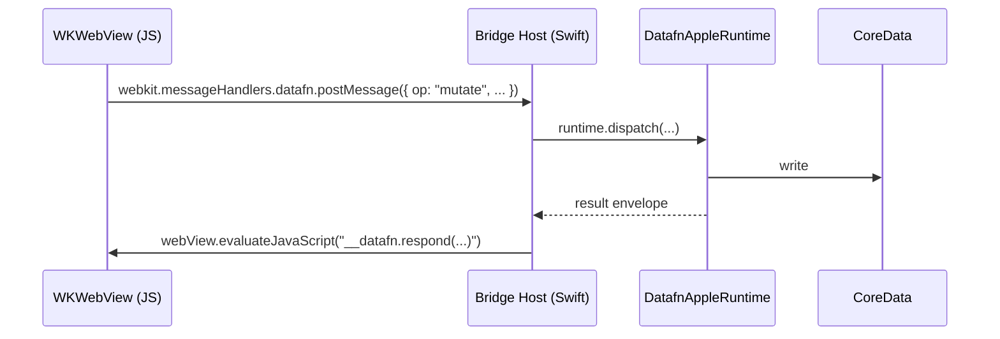

`DatafnWKWebViewBridgeHost` is the Swift companion to a `WKWebView`. It listens for messages from the JavaScript side and dispatches them into the native `DatafnAppleRuntime`. This is how hybrid apps get native persistence without rewriting the UI.

The pattern, end-to-end:



## Set up the host

```swift
import WebKit
import DatafnAppleRuntime

let bridgeHost = runtime.makeBridgeHost(handlerName: "datafn")

let webConfig = WKWebViewConfiguration()
webConfig.userContentController.add(bridgeHost, name: "datafn")
webConfig.userContentController.addUserScript(bridgeHost.bootstrapScript)

let webView = WKWebView(frame: .zero, configuration: webConfig)
webView.load(URLRequest(url: webURL))
```

`bridgeHost.bootstrapScript` is an `WKUserScript` injected at `documentStart` that wires up `window.__datafn` on the JS side.

## On the JavaScript side

The web client uses `@datafn/swift-bridge` to call into the bridge:

```typescript
import { createNativeBackedStorageAdapter, createNativeBackedRemoteAdapter } from "@datafn/swift-bridge";

const isNativeBacked = window.__DATAFN_EXAMPLE_TOPOLOGY__?.startsWith("native");

const client = createDatafnClient({
  schema,
  clientId: window.__DATAFN_NATIVE_CONFIG__?.clientID ?? crypto.randomUUID(),
  storage: isNativeBacked
    ? createNativeBackedStorageAdapter()
    : new IndexedDbStorageAdapter("my-app-db"),
  sync: isNativeBacked
    ? {
        remote: createNativeBackedRemoteAdapter(),
        offlinability: true,
        ws: false, // Swift owns the WS
      }
    : { remote: "/datafn", offlinability: true, ws: true },
});
```

`createNativeBackedStorageAdapter` proxies reads/writes through `window.__datafn`; `createNativeBackedRemoteAdapter` proxies sync operations through Swift.

## Bootstrap globals

The host injects globals **before** page load:

```swift
let bootstrap = """
  window.__DATAFN_EXAMPLE_TOPOLOGY__ = 'native-server';
  window.__DATAFN_NATIVE_CONFIG__ = {
    handlerName: 'datafn',
    clientID: '\(clientID)',
    namespace: '\(namespace)',
    schemaHash: '\(schemaHash)',
  };
"""
webConfig.userContentController.addUserScript(
    WKUserScript(source: bootstrap, injectionTime: .atDocumentStart, forMainFrameOnly: true)
)
```

The web client reads these globals on boot and picks adapters accordingly. See the [Todo app example](/docs/examples/todo-app) for the production pattern.

## Message protocol

The bridge speaks a typed JSON-RPC dialect. Each request is:

```typescript
{
  jsonrpc: "2.0",
  id: <unique>,
  method: "datafn.mutate" | "datafn.query" | "datafn.observe" | ...,
  params: <method-specific>,
}
```

The host validates, dispatches, and responds with:

```typescript
{
  jsonrpc: "2.0",
  id: <matching>,
  result: <envelope> // DatafnEnvelope<T>
}
```

Errors come back as `BRIDGE_METHOD_UNSUPPORTED`, `BRIDGE_PROTOCOL_MISMATCH`, or wrapped DataFn envelope errors.

## Failure modes

| Error | Cause | Fix |
| --- | --- | --- |
| `BRIDGE_UNAVAILABLE` | Native bridge host wasn't set up. | Call `makeBridgeHost(...)` and inject the bootstrap script. |
| `BRIDGE_PROTOCOL_MISMATCH` | Web bundle is newer/older than the host expects. | Rebuild the web bundle against the matching `@datafn/swift-bridge` version. |
| `BRIDGE_METHOD_UNSUPPORTED` | JS requested a method the host doesn't expose. | Update `DatafnAppleRuntime` or stop calling the unsupported method. |

In native-backed mode, the web client **must** fail fast if the bridge is missing. Falling back to IndexedDB would be a footgun (user expects native storage, gets browser storage).

## Two-way observation

Native code can also observe changes that originate from the bridge — the runtime fires the same `DatafnRuntimeObservationSource` events for bridge-originated writes. SwiftUI views update automatically.

## Authentication and namespace

The bridge inherits the runtime's namespace and authentication. Web-side `client.table(...).mutate(...)` doesn't carry credentials; the host adds them before reaching the DataFn server.

## Debugging

Enable verbose logging on the bridge:

```swift
bridgeHost.logger = DatafnLogger { level, message, fields in
    print("[bridge:\(level)]", message, fields)
}
```

On the JS side, set `window.__datafn.debug = true` to log every outgoing message.

## See also

- [Apple WebView Host example](/docs/examples/apple-webview-host)
- [Todo app example](/docs/examples/todo-app)
- [Setup](/docs/documentation/apple/setup)
