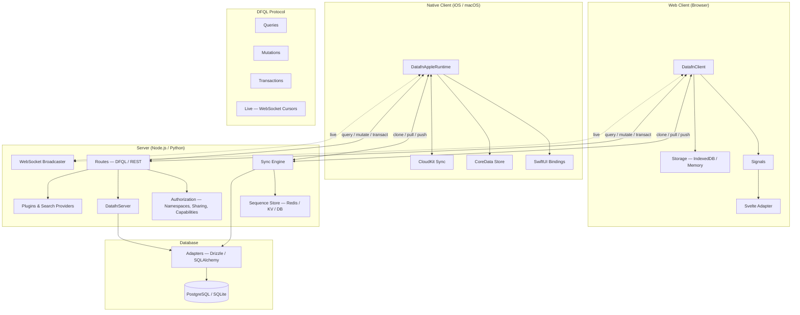

## What is DataFn?

DataFn is a **full-stack data framework**. You define your data model once, mount a set of route handlers on the backend you already have, and drop a client into your web or native app. From there you get type-safe queries and mutations, offline-first local storage, real-time sync, multi-tenant isolation, and per-record sharing — without bolting together an ORM, a query client, a sync layer, and a websocket stack yourself.

If you've ever found yourself writing `useEffect → fetch → setState → invalidate cache → handle offline → handle conflicts → handle realtime` in your apps, that's the surface area DataFn collapses.

## When DataFn is a good fit

- Apps where users care about **working offline** (mobile-first, PWAs, native).
- Apps with **collaborative or shared data** (per-record sharing, multi-tenant SaaS).
- Apps that need **live updates** between users or devices.
- Apps where you want **typed end-to-end** schemas without hand-syncing types between client and server.

If your app is a stateless CRUD form over a single Postgres database with no offline or realtime story, a plain ORM and `fetch` will probably do.

## How the pieces fit together

The **schema** in the middle (not shown) is the contract every layer agrees on — defined once, imported by both client and server.

## Packages

DataFn is split into small packages so you only install what you actually use.

### Shared

| Package | Language | What it does |
| --- | --- | --- |
| `@datafn/core` | TypeScript | Schema definition (`defineSchema`), DFQL types, capability primitives. Imported by both client and server. |

### Server

| Package | Language | What it does |
| --- | --- | --- |
| `@datafn/server` | TypeScript | `createDatafnServer()` — handlers for query / mutation / transact / sync, plus optional auto-generated REST and WebSocket broadcaster. Mount on Hono, Express, Bun, or anything fetch-compatible. |
| `datafn` (PyPI) | Python | `create_datafn_server()` — same handler surface for FastAPI / Starlette / Flask, backed by SQLAlchemy. |

### Web client

| Package | Language | What it does |
| --- | --- | --- |
| `@datafn/client` | TypeScript | `createDatafnClient()` — local storage (IndexedDB or memory), sync engine, reactive signals, optional WebSocket live updates. Framework-agnostic. |
| `@datafn/svelte` | TypeScript | Converts DataFn signals into Svelte readable stores. Other framework adapters (React, Vue, Solid, Angular) are planned but not yet shipped. |

### Native client (Apple)

| Package | Language | What it does |
| --- | --- | --- |
| `DatafnAppleRuntime` | Swift | Same client model as `@datafn/client`, but native: CoreData-backed local store, async actor runtime, observation source for reactive reads. |
| `DatafnSwiftUI` | Swift | `@Observable @MainActor` query bindings (`DatafnObservedQuery`) that drop straight into SwiftUI views. |
| `DatafnCoreDataStore` | Swift | The CoreData persistence layer used by the runtime. |
| `DatafnServerSync` | Swift | Talks to a `@datafn/server` over HTTP + WebSocket — equivalent to the web client's sync. |
| `DatafnCloudKitSync` | Swift | Alternative sync backend that uses CloudKit's private database instead of a DataFn server. |
| `DatafnWebViewBridgeHost` | Swift | Lets a `WKWebView` running `@datafn/client` share storage and sync with the native runtime. |

The Apple runtime targets **iOS 17+ and macOS 14+** and is distributed via Swift Package Manager.

### CLI

| Package | Language | What it does |
| --- | --- | --- |
| `@datafn/cli` | TypeScript | Schema validation and codegen — generates Drizzle table definitions and TypeScript types from your schema. |

## Core concepts

A short tour of the ideas you'll meet next. Each links to a deeper page.

### DFQL — DataFn Query Language

DFQL is a structured JSON protocol that describes every read and write. Both client and server speak it, so the wire format and the API surface match. DFQL covers:

- [**Schema**](/docs/dfql/schema) — typed resources, fields, indices, and relations.
- [**Queries**](/docs/dfql/queries) — filters, sorting, pagination, field selection, aggregations.
- [**Mutations**](/docs/dfql/mutations) — `insert`, `merge`, `replace`, `delete`, plus capability ops (`trash`, `restore`, `archive`, `unarchive`, `share`, `unshare`).
- [**Transactions**](/docs/dfql/transactions) — multiple operations executed atomically.

### Capabilities

Capabilities are **opt-in behaviors you switch on per resource**. Turn one on and DataFn injects the relevant system fields, exposes the matching operations on the client, and enforces the rules on the server:

- `timestamps` adds `createdAt` / `updatedAt`.
- `audit` adds `createdBy` / `updatedBy`.
- `trash` enables soft-delete via `trash()` / `restore()`.
- `archivable` adds `archive()` / `unarchive()`.
- `shareable` enables per-record sharing.

This keeps boilerplate (timestamps, soft-delete, audit trails) out of your application code. See [Capabilities](/docs/documentation/capabilities) for the full list.

### Offline-first sync

Every read and write goes through local storage first; the network is opportunistic. DataFn's sync engine moves changes between client and server in five distinct phases:

- **Clone** — initial full download of a resource.
- **Pull** — incremental download of changes since the last sync.
- **Push** — upload locally queued mutations.
- **Reconcile** — merge server-authoritative state back into local storage.
- **CloneUp** — bulk upload (mainly for native clients seeding a fresh server).

See [Offline-First Sync](/docs/documentation/sync/offline-first) for the full lifecycle.

### Real-time

The server can broadcast cursor invalidations over WebSocket, namespace-scoped and targeted at the relevant principals — so other tabs, devices, and users see fresh data without polling. See [WebSockets](/docs/documentation/server/websockets).

### Namespaces (multi-tenancy)

Row-level [namespace isolation](/docs/documentation/namespaces) is on by default. Every record carries a `__ns` column, every query is auto-scoped, and there's no way to accidentally read across tenants. You provide a `namespaceProvider` on the server (typically derived from the authenticated user's session) and DataFn handles the rest.

### Sharing

Beyond namespaces, DataFn ships a [sharing model](/docs/documentation/sharing) for collaborative apps: grant access to specific users or principals, scope the grant by relation, and let the server enforce visibility automatically.

### Plugins

Pre/post hooks on `query`, `mutation`, and `sync` flows let you add custom logic — encryption at rest, audit logging, derived fields, third-party search providers — without forking the framework. See [Plugins](/docs/documentation/plugins/overview).

## Where to next

- New here? Walk through the [Getting Started](/docs/getting-started) guide — it gets you a server, schema, and client running end-to-end.
- Ready to design your data model? Start with [Schema](/docs/dfql/schema) and [Resources](/docs/dfql/schema/resources).
- Building a UI? See [Client Setup](/docs/documentation/client/setup) and [Signals](/docs/documentation/client/signals).
- Wiring up the backend? See [Server Setup](/docs/documentation/server/setup).
