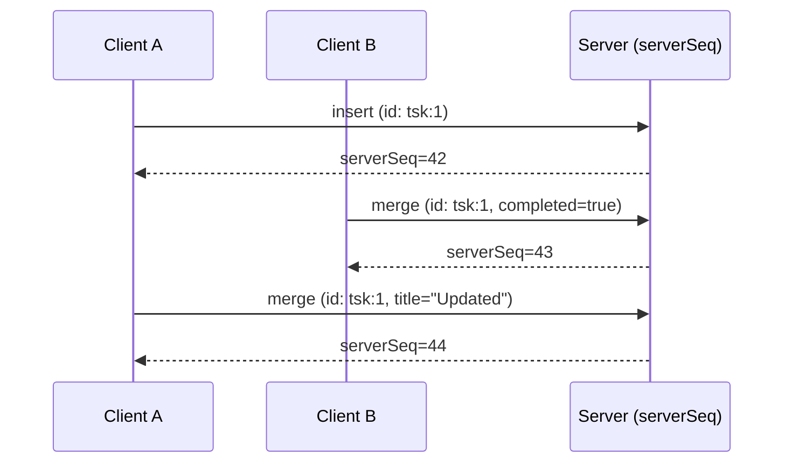

Distributed systems are full of ordering questions: when client A's write and client B's write race, which happened first? DataFn answers per-row and per-namespace, not globally.

## Per-row total order

Within a single row, operations have a total order determined by `serverSeq` — a monotonically increasing number assigned by the server at apply time.



Every subscriber will see the same sequence: insert (42), merge completed (43), merge title (44). There is no observer that sees them in a different order.

## Per-namespace total order

`serverSeq` is also globally monotonic within a namespace. Two unrelated writes — `tasks` row insert at serverSeq 42, `projects` row update at serverSeq 43 — have the same relative order for every subscriber in that namespace.

This is the basis for sync: the client requests "everything since cursor 41" and gets a deterministic, ordered stream.

## Cross-namespace: no guarantee

There is no ordering guarantee across namespaces. Namespace A's serverSeq 42 might happen before or after namespace B's serverSeq 42 in wall-clock time. The two namespaces evolve independently.

For multi-tenant SaaS this is correct — tenants don't observe each other's events anyway. For unusual cases (an internal aggregator that wants to merge two tenants' streams), you'd need a separate cross-tenant timestamp.

## Causality preservation

Within a session, **a client sees the effect of its own writes immediately and in order**, even before the server has acknowledged them. Local optimistic state preserves causal order:

```typescript
await client.table("tasks").mutate({ operation: "insert", record: { title: "A" } });
await client.table("tasks").mutate({ operation: "insert", record: { title: "B" } });
const result = await client.table("tasks").query({});
// result.data is guaranteed to include A and B in that order
```

## Push ordering

When you push offline mutations to the server, they execute in the order you push them. The server applies them as a sequence — `mutationId: m1` before `m2` before `m3` — and assigns sequential `serverSeq` values.

This matters for chains where one mutation depends on the previous:

```typescript
// Offline:
await client.table("tasks").mutate({ operation: "insert", record: { title: "Hello" }, id: "tsk:1" });
await client.table("tasks").mutate({ operation: "merge", id: "tsk:1", record: { completed: true } });
// Online:
await client.sync.push();
// Server sees: insert tsk:1, then merge tsk:1. Order preserved.
```

If the **insert fails** but the **merge** comes in a separate push, the merge will fail too (NOT_FOUND). The client surfaces both errors via `onSyncEvent`.

## Pull ordering

Pull responses include records in `serverSeq` ascending order. The client applies them in that order to its local store. After applying, the local store is consistent with the server's view at the returned cursor.

If the pull is paginated (`hasMore: true`), the client applies the first page, then pulls again with the updated cursor. There's no scenario where the client applies an "out of order" record — pagination preserves order.

## WebSocket ordering

Cursor notifications over the WebSocket are best-effort, not in-order. A client may receive `cursor=43` followed by `cursor=42` if both pushes happen close in time. The client handles this by ignoring any cursor lower than its current local cursor:

```typescript
function onCursor(serverCursor: string) {
  if (compareCursors(serverCursor, localCursor) <= 0) return;
  schedulePull();
}
```

The pull itself is in-order; the WS is just a "wake up" signal.

## Cross-client visibility

A common question: when client A writes, how soon does client B see it?

| | Same tab | Same browser, different tab | Different device |
| --- | --- | --- | --- |
| Local write | synchronous | ~50ms (cross-tab broadcast) | post-push + post-pull |
| Server-confirmed write | synchronous | ~50ms | typically 100–500ms via WS notification |
| Network outage on A | local-only | local-only | invisible until A reconnects |

The cross-device path is: A writes → A pushes → server applies → server broadcasts cursor on WS → B sees cursor → B pulls → B applies → B's signals fire. End-to-end is bottlenecked by network RTT and your server's apply time. Typical: 100–300ms.

## What's not guaranteed

- **Wall-clock causality across clients.** Client A's clock may be 30s behind client B's. `createdAt` reflects server time; DataFn doesn't use client time for ordering.
- **Cross-namespace ordering.** As above.
- **WebSocket message order.** The cursor notification can race itself; the pull is authoritative.
- **Eventual consistency time bound.** Under sustained network partition between client and server, "eventual" can be hours or days. The client's local state stays consistent; the server's state stays consistent; they merge when connectivity returns.

## See also

- [Sequence store](/docs/documentation/sync/sequence-store)
- [Conflict resolution](/docs/documentation/sync/conflict-resolution)
- [Sync overview](/docs/documentation/sync/overview)
