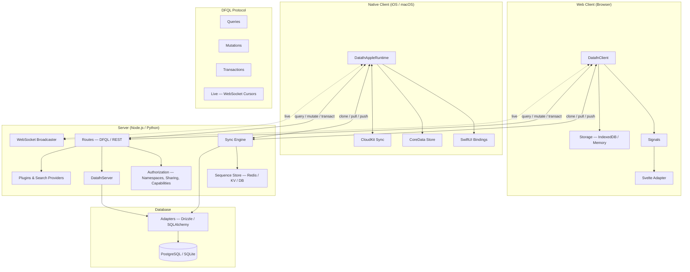

DataFn is a full-stack data framework for building modern software applications. It provides a unified approach to defining schemas, querying data, managing mutations, and synchronizing state between client and server. 

You define a schema. You get back a server, a client, a sync engine, optimistic UI primitives, multi-tenancy, sharing, search hooks, and a native Apple runtime — all with the same DFQL query shape across every layer. It replaces your ORM, query client, sync layer, and realtime stack with one type-safe, offline-first data platform you actually own.

Pick the entry point that matches what you're doing:

- **New to DataFn?** Start with the [Quickstart for your framework](/docs/quickstart).
- **Evaluating?** Read the [Comparison](/docs/comparison) and the [Architecture](/docs/documentation).
- **Building something specific?** Browse the [Recipes](/docs/recipes).
- **Looking up a config or error?** Jump to the [Reference](/docs/reference/routes).

## Batteries included

- Typed query language — DFQL
- Offline-first sync engine
- Reactive signals
- Multi-tenancy with namespace isolation
- Field-level authz
- Per-record sharing
- Auto REST API
- Native Apple runtime (CoreData + CloudKit)

## System Architecture

DataFn connects your client application to your server through DFQL, a structured query language. The client operates offline-first with local storage, syncing changes when online.

Select a section from the sidebar to get started.

----
Part of [Super functions](https://github.com/21nCo/super-functions) and built with care at [21n](https://21n.co).
