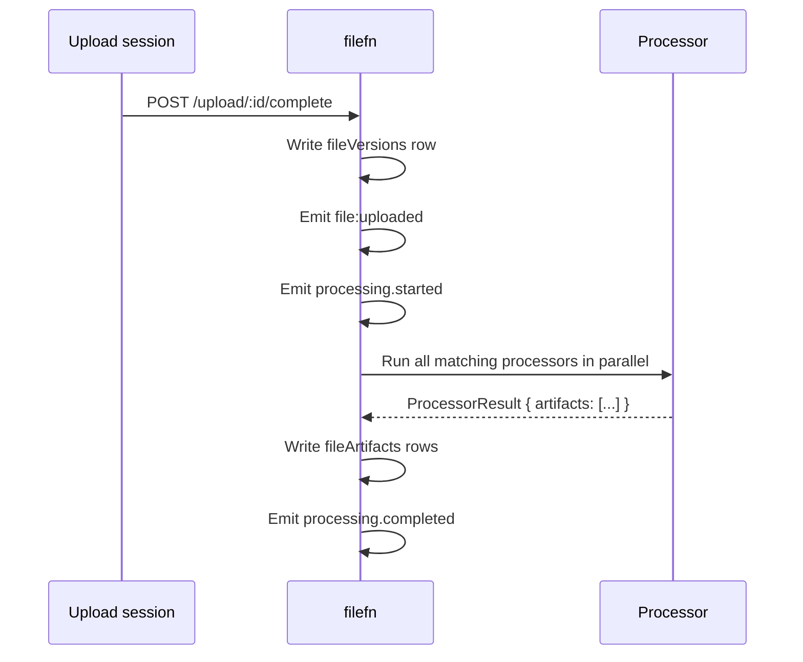

# Artifacts

Whenever a [Processor](../features/processing) produces output, the kernel writes a `fileArtifacts` row. Artifacts are first-class:

- They have stable IDs (`art_…`).
- They're addressable by `(fileId, kind)` and downloadable via `/:fileId/artifacts/:artifactId/download`.
- They participate in [render intents](./render-intents) — the resolver picks the right artifact for the requested intent.
- They can land in a different storage target than the original (`policy.artifactStorageTarget`).

## Shape

```ts
interface FileArtifactRecord {
  artifactId: string;
  fileId: string;
  versionId: string;
  kind: string;          // "thumbnail-256" | "thumbnail-1024" | "pdf-preview" | "ocr-text" | "video-poster" | …
  storageKey: string;
  mimeType: string;
  size?: number;
  metadata?: Record<string, unknown>;
  createdAt: string;
}
```

`kind` is whatever the processor declares. Bundled processors use a stable taxonomy:

| Processor | Kinds emitted |
| --- | --- |
| `createThumbnailProcessor` | `thumbnail-<name>` (one per `sizes[].name`) |
| `createPdfPreviewProcessor` | `pdf-preview-<name>` |
| `createOCRProcessor` | `ocr-text`, `ocr-hocr`, `ocr-json` |
| `createImageTransformProcessor` | `image-transform-<suffix>` |
| `createVideoProcessor` | `video-poster`, `video-transcoded-<resolution>`, `video-metadata` |
| `createAudioProcessor` | `audio-waveform`, `audio-transcoded-<codec>`, `audio-metadata` |
| `createCompressionProcessor` | `compressed-<algorithm>` |

Custom processors can declare any string as long as it's stable.

## Lifecycle



Processing happens after the upload closes. Errors are isolated:

- A processor that throws contributes a `processing.failed` event with `error: "<message>"`.
- Other processors continue.
- The original file remains intact.
- The next call to `POST /:fileId/process` retries the failed processors.

## Manual triggering

```ts
fetch(`/filefn/${fileId}/process`, {
  method: "POST",
  body: JSON.stringify({
    storageKey: existing.storageKey,
    mimeType: existing.mimeType,
    size: existing.size,
    fileName: existing.name,
    processors: ["thumbnail", "pdf-preview"], // optional whitelist
  }),
});
```

Useful when:

- you've added a new processor after content was already uploaded
- you want to re-run after a transient failure
- you want to generate processing artifacts on demand (lazy mode)

## Render-intent integration

`GET /:fileId/render?intent=thumbnail` looks up `fileArtifacts` filtered by `kind` matching the intent's preferred kinds. If no artifact exists yet, the resolver returns `state: "processing"` plus a placeholder. The client polls `/:fileId/artifacts` (or re-renders) to discover when the artifact lands.

## Off-pipeline workflows

If you want processing in a separate worker (recommended for heavy CPU work):

1. Configure `processing.flowFn` with a queue provider.
2. The kernel enqueues a job per upload instead of running processors inline.
3. The worker runs processors, calls back into filefn's `processingService.recordArtifact(...)`, and emits `processing.completed`.

See [Features › Processing](../features/processing) for the pattern.

## Cleanup

Deleting a file deletes its versions and its artifacts. The kernel does not currently support TTL'd artifacts (e.g. "delete thumbnails after 30 days") — for that, drive lifecycle through the storage adapter (S3 lifecycle rules, GCS object lifecycle, etc.).
