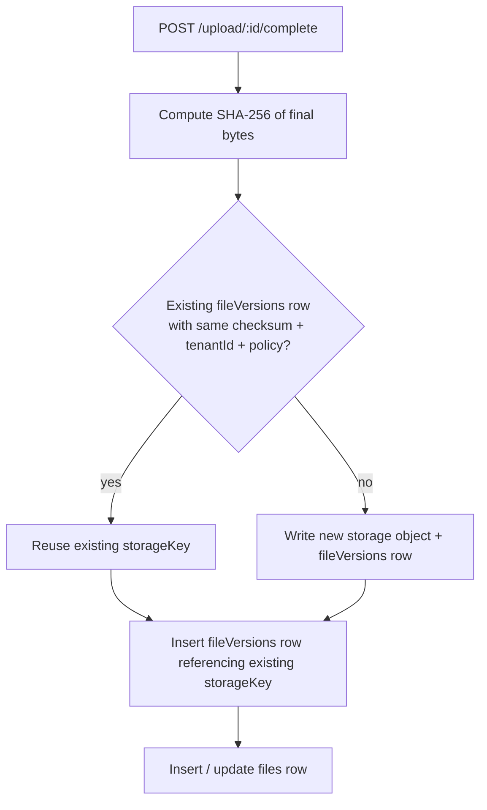

# Deduplication

When two users upload the same 50 MB PDF, you'd rather store one copy than two. filefn ships an optional dedup pipeline that does this *safely* — scoped per policy and per tenant, with explicit visibility into what's shared.

## Enabling it

```ts
const fileFn = createFileFn({
  db, storage,
  dedup: { enabled: true },
});
```

That's the entire knob. With dedup off, every upload creates a new storage object.

## How it works



Dedup matches on `(checksumSha256Base64, tenantId, policy)`:

- Different tenants → different storage objects. Always.
- Same tenant, different policies → different storage objects. Policies often imply different lifecycle and access; bridging them would surprise operators.
- Same tenant, same policy → reuse the existing storage object.

`fileVersions` rows are still 1-to-1 with logical uploads. Only the underlying `storageKey` is shared.

## Why scoped, not global

Global dedup (every byte-identical upload across the whole system points at one object) maximises savings but creates two problems:

1. **Tenant data leaks** — if tenant A's bytes are stored at the same key as tenant B's, audits and compliance get murky. Even with grants enforcing access, the storage layout would pretend they're the same file.
2. **Lifecycle conflicts** — tenant A's policy says "retain forever," tenant B's policy says "delete in 30 days." Dedup would force you to pick one.

Per-tenant + per-policy scoping avoids both. You give up some savings; you keep auditable separation.

## What dedup *doesn't* do

- It doesn't dedup parts mid-upload. Each session uploads its own bytes.
- It doesn't dedup across multipart vs. single-shot uploads (different paths, but the same final checksum).
- It doesn't ship "convergence" — if 100 users upload the same file in parallel, you may briefly write 100 storage objects before the dedup index catches up. The kernel resolves this by keeping the first stored object and orphaning later duplicates (cleaned up by the abort-expired job).

## Verifying dedup is firing

Subscribe to events:

```ts
fileFn.events.on("file:uploaded", (e) => {
  console.log("uploaded", e.fileId, e.versionId);
});
```

Then look at `fileVersions` rows: if two have the same `storageKey` (and `checksumSha256Base64`), dedup landed correctly.

## When *not* to enable dedup

- You're writing transient content (CI artifacts, transient screenshots) where storage cost is negligible and write bandwidth doesn't matter.
- You require every upload to have its own storage object for forensic reasons (e.g. immutable audit logs that pin one object per upload).

The default is off precisely because the right answer is workload-specific.
