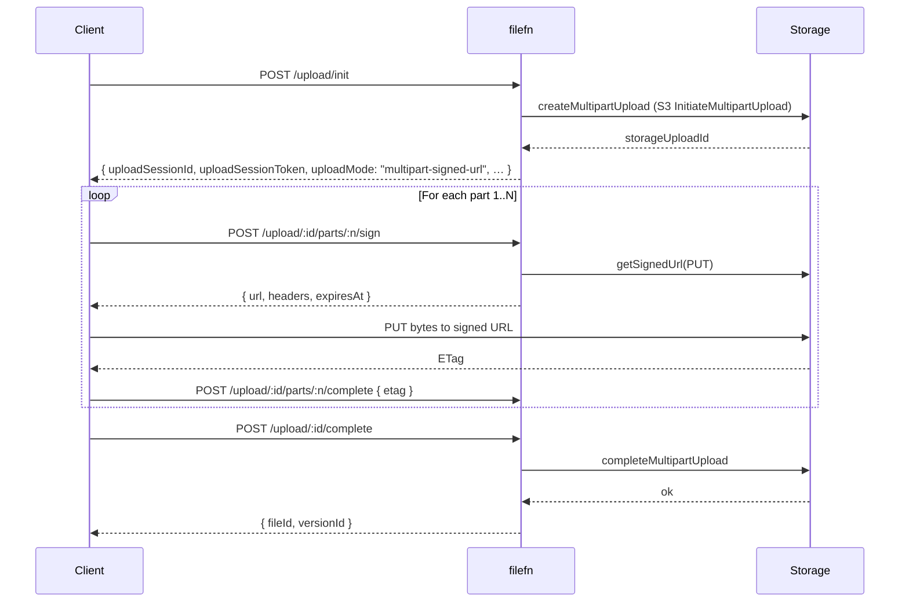
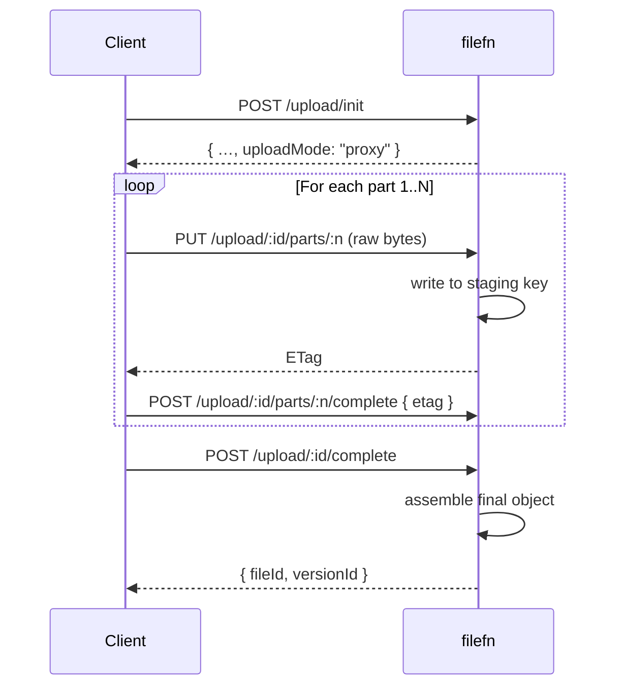

# Multipart

filefn always uses S3-style multipart uploads. The chunk size, total parts, and upload mode are all negotiated server-side at `init` time.

## Chunk size

The server picks `chunkSizeBytes` based on:

1. `defaultChunkSizeBytes` from `createFileFn` config (default: 5 MiB).
2. The storage adapter's minimum part size (S3 requires 5 MiB minimum for non-final parts).
3. The total file size (small files end up with `totalParts = 1` and a chunk equal to the file).

`totalParts = Math.ceil(size / chunkSizeBytes)`. The last part may be smaller.

Once chosen, the chunk size is locked for the session: subsequent `sign` / `complete-part` calls must respect it.

## Two modes

### `multipart-signed-url`

The default for adapters that support signed URLs (S3, GCS, Azure, R2):

Bytes never traverse the filefn server.

### `proxy`

For adapters that don't support signed URLs (local FS, custom in-process adapters):

Bytes go through the filefn process. Useful for development and for storage backends without signed-URL support.

## Why both modes?

- **Signed-URL** is faster, requires zero application bandwidth, and scales independently of the kernel. Use it whenever your storage supports it.
- **Proxy** is the only option when the storage doesn't (local FS) or when you want server-side inspection (virus scanning, content moderation, transformation). It's also the safer default for development.

The mode is invisible to the bundled SDKs — `@filefn/client`, the Python client, and the Swift client all support both transparently.

## Forcing a mode

Storage adapters expose a capability flag for signed URLs. If your adapter supports both, you can:

- Configure the adapter to disable signed URLs (always proxy).
- Add a custom adapter wrapper that proxies for some content types and signs for others (e.g. proxy small uploads to inspect, sign large ones).

filefn does not expose a per-request mode override yet. Open an issue if you need it.

## Part etags

After every successful `PUT` (signed or proxy), the server records the etag returned by storage in `uploadParts`. On `complete`, it submits the ordered etag list to the storage adapter to finalise the multipart upload.

If the same part number is completed twice with **different** etags, the server fails with `FILEFN_PART_CONFLICT`. This catches one of the most common multipart bugs (retransmitting different bytes for the same part).

## Verifying upload integrity

If your storage adapter supports it (S3 with `x-amz-content-sha256: STREAMING-AWS4-HMAC-SHA256-PAYLOAD`, or any adapter that surfaces a final SHA-256), filefn writes the checksum into `fileVersions.checksumSha256Base64`. Dedup uses this directly; clients can verify the upload by recomputing locally.
