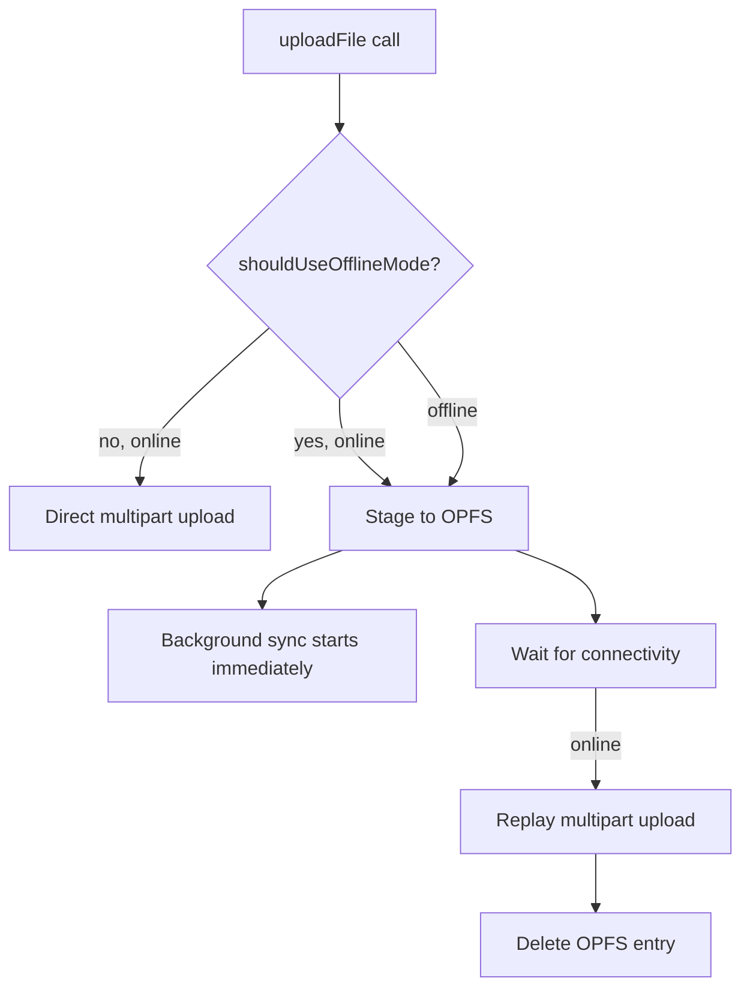

# Offline

`@filefn/client` ships an optional offline pipeline that:

- Stages uploads in the browser's [OPFS (Origin Private File System)](https://web.dev/origin-private-file-system/).
- Replays them automatically when the browser reconnects.
- Serves pending-local previews to your UI so the just-picked file shows up immediately.
- Survives page reloads.

## Enabling

```ts
import { createFileFnClient } from "@filefn/client";

const client = createFileFnClient({
  baseUrl: "/filefn",
  getAuthHeaders: async () => ({}),
  offline: { enabled: true, opfsDir: "filefn-offline" },
});
```

## What happens on `uploadFile(...)`



The check `shouldUseOfflineMode(true)` defaults to `true` — meaning the client *always* stages to OPFS first, even when online. The replay starts immediately, but the OPFS staging is the source of truth until the upload finishes.

You can opt out per call by passing `offline: { enabled: false }` to `createFileFnClient` or by checking `OPFSStore.isSupported()` and falling back to the direct path manually.

## The pending-local descriptor

When a file is staged but not yet uploaded:

```ts
const renderable = await client.resolveRenderable({
  fileId,
  intent: "preview",
  preferLocal: true,
});

// renderable.state === "pending-local"
// renderable.source.mode === "original" // points to a blob: URL
```

This works for images, PDFs, audio, and video. The client picks a preview behaviour per source kind:

- Images → direct preview from OPFS bytes.
- PDFs → direct preview when the browser supports it; otherwise a `pdf-processing` placeholder.
- Audio / video → preview only for the `preview` intent; otherwise a placeholder.
- Anything else → `unsupported-preview` placeholder.

`preferLocal: true` is the magic flag — it tells the resolver to check OPFS first before going to the server.

## OfflineSync

`OfflineSync` is the background pump. It:

- Watches `navigator.onLine`.
- Walks `OPFSStore.listPending()`.
- Calls `client.uploadFile` for each pending row, with the original input.
- Removes the OPFS row on success.
- Increments `retryCount` on failure and schedules a retry.

You can drive it manually:

```ts
import { OfflineSync, OPFSStore } from "@filefn/client";

const store = new OPFSStore({ rootDir: "filefn-offline" });
await store.init();

const sync = new OfflineSync({ store, client: { /* uploadFile shim */ } });
sync.startAutoSync();
// or
await sync.syncUpload(uploadSessionId);
```

Most apps don't need this — `createFileFnClient({ offline: { enabled: true } })` does it.

## When offline mode is the wrong choice

OPFS is a write-once store with quota constraints. Don't enable offline mode for very large file workflows (multi-GB videos) on browsers that don't grant generous quota. Detect the quota with `navigator.storage.estimate()` and fall back to direct upload when it would overflow.

## HEIC preprocessing

When `preprocessing.heic.enabled` (default `true`), HEIC inputs are transcoded to JPEG before being staged to OPFS. The OPFS row stores the *output* JPEG, so when sync runs the original HEIC is never re-converted.

## Native parity

The Swift client's `FileFnBackgroundUploader` is the same idea: persisted snapshots, automatic recovery, asset-handle previews. The shape of the persisted state (URL-only, no tokens, no absolute paths) is identical, and the WKWebView bridge exposes the same `pending-local` semantics through `filefn-bridge://asset/{handle}/preview` URLs.
