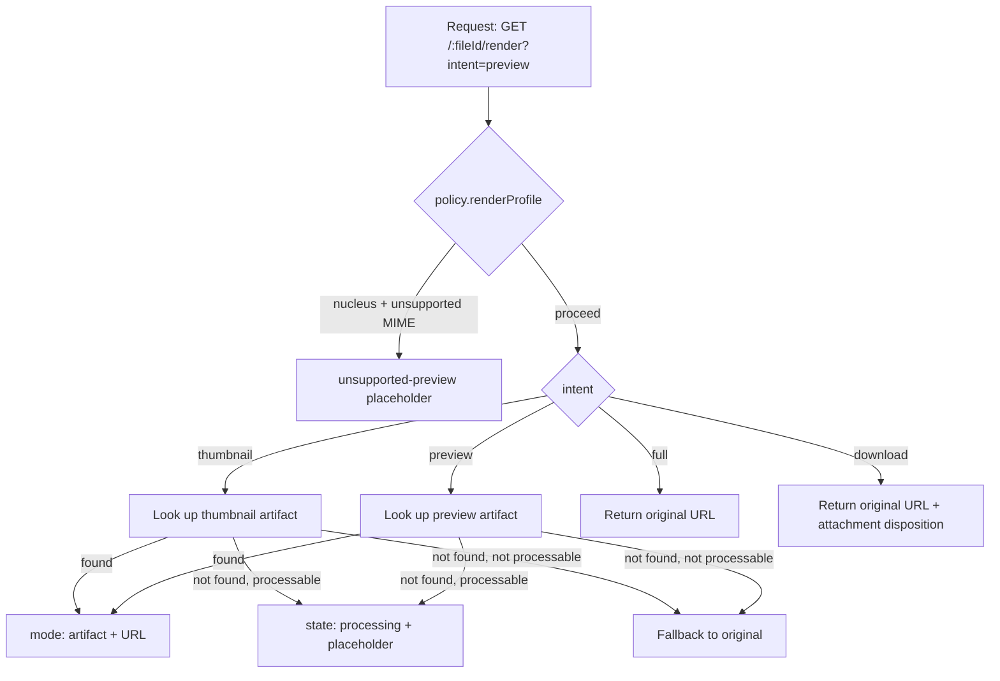

# Render intents

Most apps want the same file in multiple sizes for different UI surfaces:

- A **thumbnail** in a list / grid.
- A **preview** in a modal or split-pane.
- The **full** original for editing or zoom.
- A **download** for "save as".

filefn collapses all of these into a single API: `GET /:fileId/render?intent=…`, with a typed `RenderDescriptor` response.

## The four intents

| Intent | What you get |
| --- | --- |
| `thumbnail` | Smallest viable raster (typically a 256-px image artifact). Falls back to a placeholder. |
| `preview` | Mid-size raster — typically 1024-px. PDFs return a first-page raster. |
| `full` | Original bytes (for images, audio, video that the browser can render natively). |
| `download` | Original bytes with `Content-Disposition: attachment`. |

## The `RenderDescriptor` shape

```ts
interface RenderDescriptor {
  fileId: string;
  versionId: string;
  intent: RenderIntent;
  state: "ready" | "processing" | "pending-local" | "unsupported";
  mimeType: string;
  name: string;
  size: number;
  source:
    | { mode: "artifact"; artifactId: string; artifactKind: string; url: string; headers?: Record<string, string> }
    | { mode: "original"; url: string; headers?: Record<string, string> }
    | { mode: "placeholder"; placeholderKind: "generic-file" | "pdf-processing" | "unsupported-preview" };
  warnings?: string[];
}
```

`state` tells the UI whether to show a spinner, a placeholder, or render the URL:

- **`ready`** — bytes are available. Fetch `source.url`.
- **`processing`** — the matching artifact is queued or running. The UI should show a placeholder (`source.mode === "placeholder"`) and refresh later.
- **`pending-local`** — the file is staged offline and not yet uploaded. The URL is an OPFS-backed `blob:` or bridge URL.
- **`unsupported`** — there's no artifact for this intent and the original isn't viewable. Fall back to the placeholder.

## How filefn resolves an intent



This is the same logic the bundled `@filefn/viewer` resolver implements client-side, just with the offline / pending-local branch added.

## Placeholders

When there's no usable bytes — yet, or ever — filefn returns `mode: "placeholder"` with a `placeholderKind`:

- `generic-file` — fallback for files without a renderable preview (e.g. a `.zip`).
- `pdf-processing` — PDF preview is being generated. The UI can show a "loading…" PDF illustration.
- `unsupported-preview` — the file's MIME type isn't in the policy's render allowlist.

Placeholders are descriptors only — filefn doesn't ship icons. The client picks a UI for each kind.

## Versioning

Pass `?versionId=ver_…` to render an older version of a file.

## Pending-local previews

When `@filefn/client` has `offline.enabled` and a file is staged but not yet uploaded:

```ts
const renderable = await client.resolveRenderable({
  fileId,
  intent: "preview",
  preferLocal: true,
});
```

The client checks OPFS first. If the file is staged, it returns a `pending-local` descriptor with a `blob:` URL pointing at the local copy. This lets your UI show the user's just-picked photo immediately, without waiting for the upload.

`@filefn/swift-bridge` has the same behaviour through `filefn-bridge://asset/{handle}/preview` URLs.

## Why one API and not four

Without a single resolver, every UI surface has to know:

1. Whether the file is uploaded.
2. Whether processing has started, finished, or failed.
3. Whether the artifact for this size exists.
4. Whether the storage adapter signs URLs or proxies them.
5. Whether to fall back to the original, a placeholder, or an OPFS URL.

That's a lot of branching. The render-intent API condenses it into a single typed response that's easy to switch on in any UI framework.
