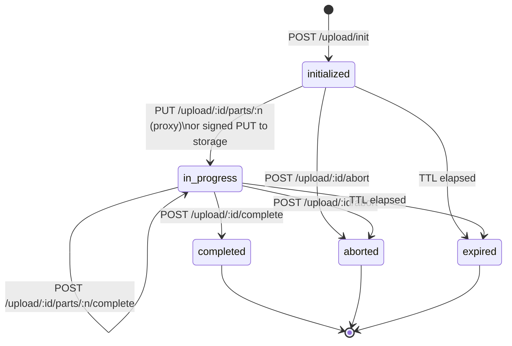

# Upload sessions

Every upload — small or large, browser or server — goes through a session. The session is the thing the server tracks: it owns the chunk size, the part status, the idempotency lock, the storage key, the anonymous `uploadSessionToken`, and the eventual `versionId` that closes the loop.

## Lifecycle



States:

- **initialized** — session row exists, no parts recorded yet.
- **in_progress** — at least one part has been recorded.
- **completed** — `complete` succeeded, `fileVersions` row written, session is read-only.
- **aborted** — explicit abort or implicit cleanup. The session is gone.
- **expired** — TTL hit. The cleanup job evicts the row and any orphaned storage objects.

## What `init` returns

```json
{
  "uploadSessionId": "upl_…",
  "uploadSessionToken": "upls_live_…",
  "uploadMode": "multipart-signed-url",
  "chunkSizeBytes": 5242880,
  "totalParts": 3,
  "expiresAt": "2025-01-01T01:00:00.000Z"
}
```

- `uploadSessionId` — the public id you reference in subsequent calls.
- `uploadSessionToken` — anonymous token. Required as `x-upload-session-token` for status / sign / complete / abort. Mint it once; never log it.
- `uploadMode` — `multipart-signed-url` or `proxy`. Picked by the adapter.
- `chunkSizeBytes` — server-determined chunk size. The client splits the file into `totalParts` chunks of this size (the last part may be smaller).
- `totalParts` — derived from `Math.ceil(size / chunkSizeBytes)`.
- `expiresAt` — ISO timestamp. After this, all part operations fail with `FILEFN_UPLOAD_EXPIRED`.

## TTLs

- **`uploadSessionTtlSeconds`** (default `86400` / 24h) — the session row is valid for this long. Aborted or completed sessions are removed immediately.
- **`signedUrlTtlSeconds`** (default `900` / 15m) — each signed part URL is valid for this long. Re-sign a part with `POST /upload/:id/parts/:n/sign` if it expires.

Both can be overridden per call to `createFileFn`.

## Idempotency

Pass `x-idempotency-key: <opaque>` on `POST /upload/init`. The server hashes the canonical request payload (`policy + fileName + size + mimeType + metadata`) and stores it. A second request with:

- the same key + the same canonical payload → returns the same `uploadSessionId`. Safe to retry.
- the same key + a different canonical payload → fails with `FILEFN_IDEMPOTENCY_CONFLICT`.

This is what makes accidental double-clicks (and dropped responses on flaky networks) safe.

## Anonymous upload session token

`uploadSessionToken` is the auth boundary for everything *after* `init`. The token:

- is minted once per session
- is stored only as a hash in `uploadSessions.uploadSessionTokenHash`
- is required on `status`, `sign`, `complete`, `abort` (and the proxy `PUT` for parts)
- is short-lived (the session TTL)

This lets you do client-side / browser-side multipart uploads where the user has no long-lived auth token, without exposing the rest of the API.

## Recovery

If the client crashes mid-upload:

1. The server still has the session in `in_progress`, with whatever parts were recorded.
2. The client comes back, calls `GET /upload/:id/status` with the session token, and gets back `{ recordedParts, totalParts, chunkSizeBytes }`.
3. The client retransmits only the missing parts.
4. The client calls `POST /upload/:id/complete`.

`@filefn/client` does this automatically through `client.resumeUpload(...)`. The Swift client's background uploader does the equivalent on app relaunch.

## Storage key

When `init` succeeds, the server pre-computes a deterministic `storageKey` for the upload using the policy's `storagePath` function. The default is:

```
<tenantId>/<principalId>/<fileId>/<versionId>-<fileName>
```

You can override `storagePath` per policy if you want a different layout. Storage keys are stable for the lifetime of a version.

## Why a session, not an "upload" endpoint?

Single-shot `POST /upload` works for small files. It loses to a session-based design for everything else:

- **Resume** — without state on the server, you can't tell which bytes the client already sent.
- **Idempotency** — without a session id, retried `POST /upload`s either dedupe wrongly or duplicate the file.
- **Backpressure** — without per-part status, the client can't pace itself or recover from partial failure.
- **Anonymous uploads** — without a session token, you'd need to expose the full auth scope on every part.

filefn always goes through a session, even for files that fit in one part. The cost is a single extra round-trip; the benefit is uniform behaviour across small, large, online, and offline uploads.
