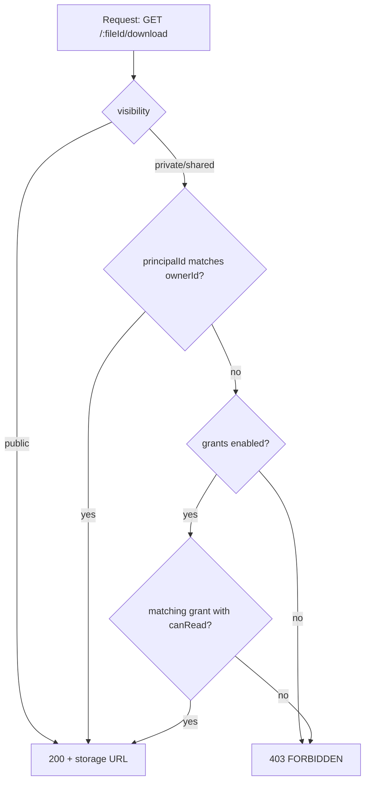

# Visibility

Visibility is a per-policy flag that controls who can fetch a file's bytes:

- `public` — anyone with the file URL can download.
- `private` — only the owner (or a principal with a matching grant) can download.
- `shared` — same enforcement as `private`, with a UI hint that explicit sharing is expected.

It does **not** control listing — `GET /` always lists files visible to the current principal, regardless of visibility.

## Public

Public files have download URLs that don't require authentication. The actual transport depends on the storage adapter:

- S3 / GCS / Azure / R2 with public buckets — the download URL is the bucket URL (or a CDN URL on top).
- Adapters with private buckets — the URL is a long-lived signed URL.
- Local / proxy — the URL hits filefn's `/proxy/files/:fileId/download`, which streams from storage.

`public` does not skip the policy check on upload. A 5 GB file uploaded under `public-image` still has to fit `maxSizeBytes`.

## Private

Private files require:

- a session cookie / bearer token that resolves to the file's `ownerId`
- or a matching grant (when grants are enabled)
- or a valid share-link token

`/:fileId/download` returns `FILEFN_FORBIDDEN` for any other caller.

## Shared

`shared` enforces the same rules as `private`. The label exists for clients that want to surface "this file is shareable" in their UI without re-deriving it from grants. The kernel does not branch on `shared` differently from `private`.

## How visibility resolves at request time

Share-link downloads bypass the principal/grant check by carrying their own token.

## Implementation note

Visibility flows through the `Authorizer` interface. The default authorizer (`createDefaultAuthorizer`) implements the table above. Replace it (`composeAuthorizers`, custom `AuthorizerStrategy`) when you want richer rules — e.g. tenant-wide read for org admins.

## Picking the right visibility

- User avatars, public-marketing assets, app-icons → `public`.
- User-uploaded content the user later shares with one or two others → `shared` + grants.
- User-uploaded content that's strictly personal → `private`.

You can change a file's visibility after upload (via grants), but not its policy. If you need the same content under different policies, upload it twice — dedup handles the storage cost.
