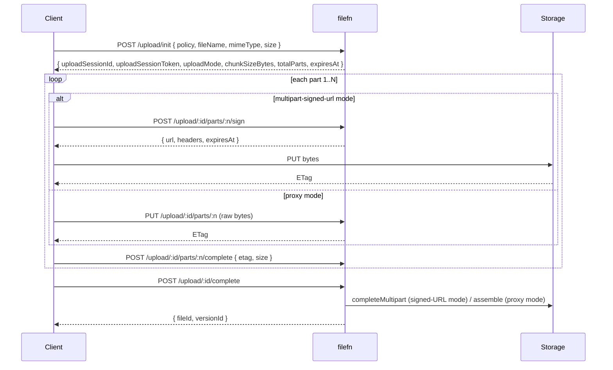

# Uploads

The upload feature is always on. It owns:

- `uploadSessions` and `uploadParts` in the schema
- the `/upload/*` route tree
- the `upload.started`, `part.recorded`, and `file:uploaded` events

## End-to-end flow



## Configuration knobs

```ts
createFileFn({
  defaultChunkSizeBytes: 5 * 1024 * 1024,   // S3 minimum
  uploadSessionTtlSeconds: 24 * 60 * 60,    // 24h
  signedUrlTtlSeconds: 15 * 60,             // 15m per part
});
```

- `defaultChunkSizeBytes` — minimum chunk size. The adapter may bump it up.
- `uploadSessionTtlSeconds` — how long a session row lives.
- `signedUrlTtlSeconds` — how long each part's signed URL lives.

## Routes

| Route | Description |
| --- | --- |
| `POST /upload/init` | Create a session. Optional `x-idempotency-key`. |
| `GET /upload/:id/status` | Get session status. Requires `x-upload-session-token`. |
| `POST /upload/:id/parts/:n/sign` | Sign a single part. |
| `PUT /upload/:id/parts/:n` | Upload part bytes (proxy mode). |
| `POST /upload/:id/parts/:n/complete` | Record the etag of a finished part. |
| `POST /upload/:id/complete` | Finalise the session. Returns `{ fileId, versionId }`. |
| `POST /upload/:id/abort` | Abort. Cleans up storage and DB rows. |

## Bundled SDKs

`@filefn/client` (`uploadFile`, `resumeUpload`), the Python client, and the Swift `FileFnForegroundUploader` / `FileFnBackgroundUploader` all implement the full state machine. You don't usually call these routes by hand.

## When to call by hand

- You're building a new client SDK in a language that's not yet supported.
- You're driving filefn from a server-to-server context (CI uploading artifacts, a worker uploading processing output).
- You need a non-default flow (e.g. proxy-only, or only-init-then-hand-off).

For server-to-server uploads from Node, you can skip the multipart machinery and call the `FileProvider` interface directly:

```ts
const session = await fileFn.createUploadSession(
  { policy: "internal-artifact", fileName: "build.tar.gz", size: 2_000_000_000, mimeType: "application/gzip" },
  ctx,
);

// then sign / complete each part using fileFn.signUploadPart / completeUploadPart
```

This bypasses the HTTP layer entirely.

## Recovery

Sessions are durable. If your server crashes mid-upload:

- The DB row stays.
- Parts already recorded stay.
- The client resumes by calling `GET /upload/:id/status`, then re-signs missing parts.

The bundled clients do this on `client.resumeUpload(uploadSessionId, file, { uploadSessionToken })`.

## See also

- [Core Concepts › Upload sessions](../core-concepts/upload-sessions) — full lifecycle.
- [Core Concepts › Multipart](../core-concepts/multipart) — signed-URL vs. proxy.
- [Core Concepts › Idempotency](../core-concepts/idempotency).
