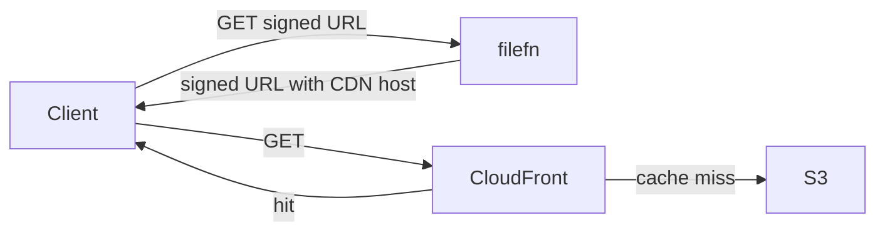
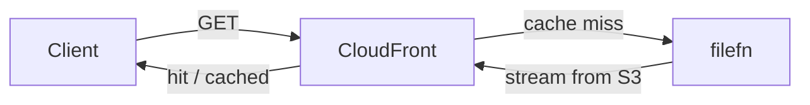

# CDN integration

Goal: bandwidth-heavy reads (downloads, thumbnails, previews) go through a CDN; auth and metadata stay with filefn.

## Two patterns

### Pattern A — CDN in front of the storage bucket



Signed URLs are minted by filefn with the CDN host substituted. The CDN forwards them to S3 transparently.

```ts
const storage = createS3Storage({
  region: "us-east-1",
  bucket: "filefn-prod",
  cdnPrefix: "https://cdn.example.com",
  // ...
});
```

CDN config:

- Origin: your S3 bucket.
- Forward query strings (signed URL parameters live there).
- Cache key: include the relevant query parameters.
- TTL: shorter than `signedUrlTtlSeconds` (15 min).

### Pattern B — CDN in front of filefn



Use the `/proxy/files/...` routes. The CDN caches filefn responses, not S3 responses. This works when:

- you want filefn to apply Content-Disposition rewrites
- you want CDN-level rate limiting on filefn routes
- you want the CDN to cache responses for many users with identical access (e.g. public files)

CDN config:

- Origin: your filefn host.
- Forward `Authorization` for private files (or `Vary: Authorization`).
- Don't cache `4xx`s.

For public files, mark them `public` and let the CDN cache aggressively.

## Public buckets

For genuinely public files (avatars, brand assets):

```ts
fileFn.definePolicy("public-avatar", {
  contentTypes: ["image/png", "image/jpeg"],
  maxSizeBytes: 5 * 1024 * 1024,
  visibility: "public",
  storageTarget: "public-cdn",
  // ...
});

const storageRouter = createStorageRouter({
  default: durable,
  targets: {
    "public-cdn": createS3Storage({
      bucket: "public-assets",
      cdnPrefix: "https://cdn.example.com",
      // bucket policy: public-read
    }),
  },
});
```

Visibility `public` skips the auth check; the bucket-level policy serves the bytes; signed URLs aren't required.

## Per-tenant CDNs

Different tenants might need different CDN domains (e.g. white-label deployments):

```ts
const storage = createStorageRouter({
  default: durable,
  resolveTarget: (input) => {
    if (input.policy === "tenant-asset") {
      return createS3Storage({
        bucket: `${input.tenantId}-assets`,
        cdnPrefix: `https://${input.tenantId}.cdn.example.com`,
      });
    }
    return durable;
  },
});
```

`resolveTarget` runs per request — cache the adapter instances per tenant for efficiency.

## See also

- [Storage targets](../core-concepts/storage-targets) — multi-target routing.
- [Adapters › S3](../adapters/storage-s3) — `cdnPrefix` semantics.
