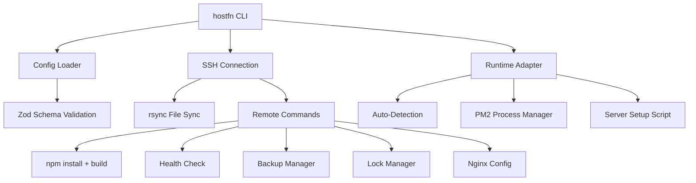

HostFn is designed around a few core principles that make it reliable and easy to use.

## Architecture



## Key Concepts

### Configuration-Driven

Every deployment is defined by a single `hostfn.config.json` file. This file is validated against a Zod schema at load time, catching configuration errors early before any remote commands are executed.

### Environment-Based

HostFn supports multiple environments (production, staging, etc.) in a single configuration file. Each environment can point to a different server, use different ports, and have different scaling settings.

### Runtime Adapters

HostFn uses a pluggable runtime system. Currently, Node.js is the primary supported runtime, but the architecture supports adding Python, Go, Ruby, and Rust adapters.

### SSH-First

All remote operations happen over SSH. HostFn connects once and runs all commands through that connection. File transfers use rsync over SSH for efficient, incremental syncing.

### Fail-Safe Deployments

Every deployment creates a backup of the current state. If any step fails (build, health check, etc.), HostFn automatically rolls back to the previous deployment and reloads PM2.

## Deployment Lifecycle

A typical deployment follows these phases:

| Phase | What Happens |
|---|---|
| **1. Pre-flight** | Validate config, check rsync, connect to server, verify Node.js version, acquire deployment lock |
| **2. Workspace Bundle** | (Monorepos only) Detect workspace dependencies, bundle them into deployment |
| **3. File Sync** | rsync project files to remote server, excluding configured patterns |
| **4. Build** | Install npm dependencies, run build command on the server |
| **5. Backup** | Create timestamped backup of existing deployment |
| **6. PM2 Deploy** | Generate PM2 ecosystem config, start or reload the service |
| **7. Health Check** | Poll health endpoint until the service responds or retries are exhausted |
| **8. Cleanup** | Remove old backups beyond retention limit, release deployment lock |

If anything fails after the backup is created, HostFn restores the backup and reloads PM2 automatically.

## Directory Structure on Server

HostFn uses a standard directory layout on the remote server:

```
/var/www/
  my-app-production/        # Application root
    dist/                    # Build output
    node_modules/            # Dependencies
    package.json
    ecosystem.config.cjs     # PM2 configuration
    .env                     # Environment variables
    .hostfn-deploy.lock      # Deployment lock file
    backups/                 # Timestamped backups
      2024-01-15T10-30-00-000Z/
      2024-01-14T15-20-00-000Z/
```

The remote directory path is derived from your application name and environment: `/var/www/{name}-{environment}`.
