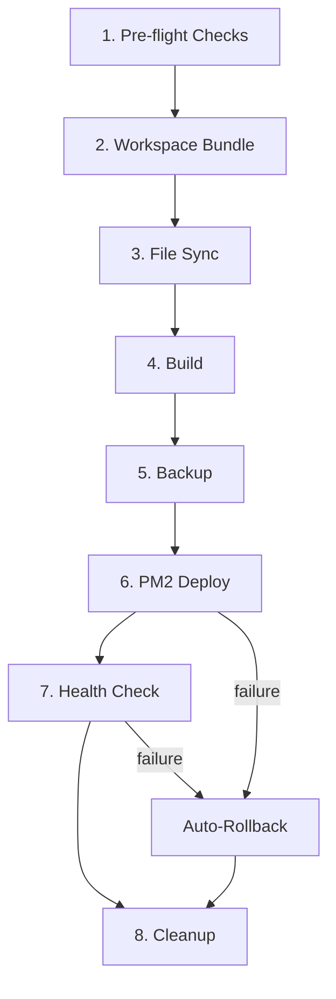

HostFn deploys your application through a structured 8-phase lifecycle. Each phase has a clear responsibility, and if anything fails after a backup has been created, HostFn automatically rolls back to the previous working deployment.

## The 8-Phase Deployment Lifecycle

Every `hostfn deploy` execution follows this sequence:



### Phase 1: Pre-flight Checks

Before anything is transferred or modified, HostFn verifies the deployment environment is ready.

| Check | Description |
|---|---|
| rsync availability | Confirms `rsync` is installed locally (skipped in `--local` mode) |
| SSH connection | Establishes a connection to the server via SSH |
| Node.js version | Verifies the correct Node.js version is active (installs via nvm if needed) |
| PM2 availability | Confirms PM2 is installed globally (installs if missing) |
| Remote directory | Creates `/var/www/{name}-{env}` if it does not exist |
| Deployment lock | Acquires a lock file to prevent concurrent deployments |

If any pre-flight check fails, the deployment aborts before any files are modified.

### Phase 2: Workspace Bundle

If your project is part of a monorepo with workspace dependencies (e.g., npm workspaces), HostFn detects them automatically and creates a self-contained deployment bundle. Workspace dependencies are copied into a `__workspace__/` directory and `package.json` references are rewritten to use `file:` paths. A lockfile is generated locally to ensure deterministic installs on the server.

This phase is skipped entirely for standalone (non-workspace) projects.

### Phase 3: File Sync

Source files are transferred to the server using `rsync` over SSH. The sync uses archive mode with compression (`-avz`) and deletes files on the server that no longer exist locally (`--delete`).

Files matching the `sync.exclude` patterns in your config are excluded. The defaults are:

```
node_modules, .git, .github, dist, build, .env, .env.*, *.log, .turbo, .wrangler
```

In `--local` mode, files are copied directly using the filesystem instead of rsync.

### Phase 4: Build

HostFn installs dependencies and runs your build command on the server.

1. **Dependency installation** -- Uses `npm ci` when a lockfile is present, `npm install` otherwise. If a `build.command` is configured, all dependencies (including devDependencies) are installed; otherwise only production dependencies.
2. **Build execution** -- Runs your `build.command` (e.g., `npm run build`). Skipped if no build command is configured.

### Phase 5: Backup

Before the PM2 process is modified, HostFn creates a timestamped backup of the current deployment's `dist/` directory and best-effort copies `package.json`. Backups are stored at `/var/www/{name}-{env}/backups/`.

If this is the first deployment (no existing `dist/` directory), the backup step is skipped.

### Phase 6: PM2 Deploy

HostFn generates a PM2 ecosystem configuration file (`ecosystem.config.cjs`) and starts or reloads the process.

- **First deployment**: PM2 starts a new process using the ecosystem config
- **Subsequent deployments**: PM2 deletes and restarts the process with the updated config

The ecosystem config includes environment variables read from the server's `.env` file, cluster mode settings, log paths, and auto-restart policies.

### Phase 7: Health Check

After the service is started, HostFn polls the health endpoint using `curl` on the server:

```
curl -sf http://localhost:{port}{healthPath}
```

The check retries up to `health.retries` times (default: 10) with `health.interval` seconds (default: 3) between attempts. Each curl request also uses `health.timeout` as its per-attempt timeout. Success follows curl's `-f` exit-code behavior.

If all retries are exhausted without a healthy response, the deployment is considered failed and triggers an automatic rollback.

### Phase 8: Cleanup

After a successful deployment, HostFn:

1. Removes old backups beyond the configured retention count (`backup.keep`, default: 5)
2. Releases the deployment lock
3. Cleans up any temporary workspace bundle directories

## Automatic Rollback

If the deployment fails **after** a backup has been created (during phases 6 or 7), HostFn automatically:

1. Restores the previous deployment from the backup
2. Reloads the PM2 process with the old version
3. Reports the rollback result

```
  Deployment failed!
  Service is not responding to health checks

  ── Rolling Back ──

  ✔ Rolled back to previous deployment
  Previous deployment restored successfully
```

If the rollback itself fails, HostFn logs a message indicating manual intervention is required.

<Callout type="info">
Rollback only applies when there is a previous deployment to restore. First-time deployments that fail require manual investigation.
</Callout>

## Deployment Lock

HostFn uses a lock file on the server to prevent concurrent deployments to the same application and environment. If another deployment is already in progress, the lock acquisition will fail and the deployment will abort. The lock is released in the `finally` block whenever the deploy process can still run cleanup.

## Typical Deployment Output

```
$ hostfn deploy production

  Deploy Application

  Application       my-api
  Runtime           nodejs
  Environment       production
  Server            ubuntu@my-server.com
  Port              3000
  Remote Directory  /var/www/my-api-production

  ── Pre-flight Checks ──

  ✔ rsync available
  ✔ Connected to server
  ✔ Node.js v20.11.0 ready
  ✔ Remote directory created
  ✔ Deployment lock acquired

  ── Syncing Files ──

  ✔ Files synced successfully

  ── Building Application ──

  ✔ Dependencies installed
  ✔ Build completed

  ── Creating Backup ──

  ✔ Backup created: 2026-03-11T14-30-00-000Z

  ── Deploying Service ──

  ✔ Service reloaded

  ── Health Check ──

  ✔ Health check passed

  Deployment completed successfully!

  Environment  production
  Service      my-api-production
  Duration     42s
  Health URL   http://my-server.com:3000/health
```

## Next Steps

- [Single Service Deployment](/docs/documentation/deployment/single-service) -- Deploy a standard Node.js application
- [Monorepo Deployment](/docs/documentation/deployment/monorepo) -- Deploy multiple services from a monorepo
- [CI/CD Integration](/docs/documentation/deployment/ci-cd) -- Automate deployments with GitHub Actions
