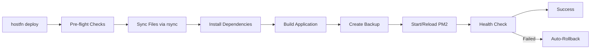

HostFn is a deployment CLI that makes it simple to deploy Node.js applications to any Linux server over SSH. It handles the entire deployment lifecycle: server provisioning, file syncing, building, process management with PM2, Nginx configuration, SSL certificates, health checks, backups, and rollbacks.

## Why HostFn?

Deploying to a VPS or bare-metal server shouldn't require complex infrastructure. HostFn gives you production-grade deployments with a single command:

```bash
hostfn deploy production
```

**No Docker required.** No Kubernetes. No cloud-specific lock-in. Just your code running on your server.

## Key Features

- **Zero-downtime deployments** - PM2 cluster mode with graceful reloads
- **Automatic server setup** - One command provisions Node.js, PM2, Nginx, and SSL
- **Monorepo support** - Deploy multiple services from a single codebase with workspace dependency bundling
- **Environment management** - Push, pull, set, and validate environment variables securely
- **Automatic rollbacks** - Failed deployments automatically restore the previous version
- **Nginx and SSL** - Auto-configures reverse proxy and Let's Encrypt certificates
- **CI/CD ready** - Non-interactive mode with SSH key and host environment variables
- **Health checks** - Configurable endpoint polling after each deployment
- **Deployment locks** - Prevents concurrent deployments to the same server
- **Backup management** - Timestamped backups with configurable retention

## Quick Start

```bash
# Install
npm install -g hostfn

# Initialize a project
hostfn init

# Set up your server
hostfn server setup ubuntu@your-server.com

# Deploy
hostfn deploy production
```

## How It Works



HostFn connects to your server via SSH, syncs your project files using rsync, installs dependencies, builds your application, and manages the PM2 process. If anything fails, it automatically rolls back to the previous deployment.

## Requirements

- **Node.js** 18+ (on your local machine)
- **rsync** installed locally (macOS: `brew install rsync`, Ubuntu: `apt install rsync`)
- A **Linux server** with SSH access (Ubuntu, Debian, CentOS, or similar)
- **SSH key** authentication configured

## Next Steps

<Cards>
  <Card title="Getting Started" href="/docs/documentation/getting-started/installation" description="Install HostFn and set up your first project." />
  <Card title="Configuration" href="/docs/documentation/concepts/configuration" description="Learn about the hostfn.config.json file." />
  <Card title="CLI Reference" href="/docs/cli" description="Complete command reference." />
  <Card title="CI/CD Setup" href="/docs/documentation/deployment/ci-cd" description="Automate deployments with GitHub Actions." />
</Cards>
