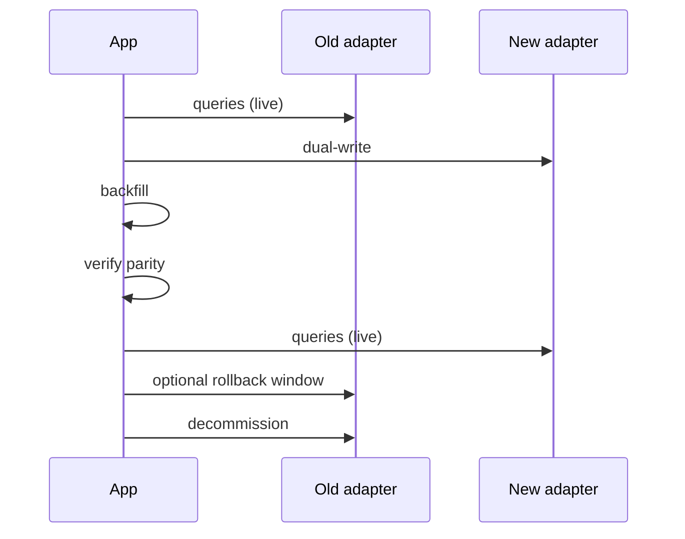

Switching adapters is mostly a one-line code change. The hard parts are: (1) moving the index data, (2) keeping queries serving traffic during the move, and (3) verifying parity afterwards.

## The pattern



The whole sequence is the same shape regardless of the source/destination pair.

## Step 1 — dual-write

Add the new adapter alongside the old one and write to both:

```typescript
import { MemoryAdapter } from "@searchfn/adapter-memory";
import { PostgresAdapter } from "@searchfn/adapter-postgres";

class DualAdapter implements SearchAdapter {
  readonly name = "dual";
  constructor(public read: SearchAdapter, public write: SearchAdapter) {}

  async initialize(p) { await this.read.initialize?.(p); await this.write.initialize?.(p); }
  async index(p)      { await Promise.all([this.read.index(p), this.write.index(p)]); }
  async remove(p)     { await Promise.all([this.read.remove(p), this.write.remove(p)]); }
  async clear(r, s)   { await Promise.all([this.read.clear(r, s), this.write.clear(r, s)]); }
  async search(p)     { return this.read.search(p); }
}
```

Wire it in:

```typescript
const sf = await createSearchFnServer({
  adapter: new DualAdapter(oldAdapter, newAdapter),
  basePath: "/searchfn",
});
```

New documents flow into both indices. Queries still hit the old one.

## Step 2 — backfill

For data already in the old index, copy it across.

**Memory → Postgres / Meilisearch / Elasticsearch**: re-index from your source-of-truth DB. The memory adapter doesn't expose a snapshot iterator; the original data lives in DataFn (or your DB), so you re-run the indexer.

**Postgres → another adapter**: stream rows from the SearchFn `_searchfn_*` tables and re-index. Or, for parity, re-index from the source DB.

**Cross-adapter**: re-index from the canonical source (DataFn, your DB, etc.). Don't try to ship the indexed form across — formats differ.

```typescript
import { rebuildFromSource } from "./backfill";

for await (const batch of streamFromSource()) {
  await newAdapter.index({ resource: "articles", documents: batch });
}
```

See [backfill from DB](/docs/recipes/backfill-from-db) for the throttle-and-resume pattern.

## Step 3 — verify parity

Run a small batch of queries against both adapters and compare:

```typescript
const queries = ["ranking", "bm25 swift", "fuzzy"];

for (const q of queries) {
  const oldIds = await oldAdapter.search({ resource: "articles", query: q });
  const newIds = await newAdapter.search({ resource: "articles", query: q });

  const overlap = oldIds.filter((id) => newIds.includes(id)).length;
  const pct = (overlap / oldIds.length) * 100;
  console.log(`"${q}": ${pct.toFixed(1)}% overlap`);
}
```

Don't expect 100% — different scoring algorithms produce different rankings. Aim for:

- >90% overlap in the top 10
- >70% overlap in the top 50

If overlap is lower, the new adapter is doing something wildly different — investigate before cutover.

## Step 4 — flip the read

Once you're satisfied:

```typescript
class DualAdapter implements SearchAdapter {
  ...
  async search(p) { return this.write.search(p); }  // was: this.read
}
```

Or remove the dual wrapper entirely:

```typescript
const sf = await createSearchFnServer({
  adapter: newAdapter,                              // direct
  basePath: "/searchfn",
});
```

Deploy. Queries now hit the new adapter.

## Step 5 — keep a rollback window

For at least one full reindex cycle:

- Keep the old adapter's data fresh (continue dual-writing).
- Have a feature flag to flip reads back to the old adapter.

If you see post-cutover problems, flip the flag and roll forward at your own pace.

## Step 6 — decommission

After the rollback window:

- Stop dual-writing.
- Drop the old adapter's tables / indices.
- Remove the dual-adapter code.

## Special cases

### Postgres → Meilisearch

Meilisearch wants documents in its own JSON shape. The SearchFn `MeilisearchAdapter` does the mapping for you — just use it.

### Elasticsearch → OpenSearch

The two adapters are nearly identical. Switching is `import` change + cluster swap. No backfill needed if you're forking an ES cluster as OS (OpenSearch is forked from ES 7).

### Memory → IndexedDB

This isn't a server change; it's a client/embedded change. Re-index from your source. Same pattern.

### TypeScript → Python

Different engines (BM25 vs term-count). Parity isn't possible. Use this migration as an opportunity to evaluate whether term-count meets your needs.

## See also

- [Writing an adapter](/docs/documentation/advanced/writing-an-adapter)
- [Reindex with no downtime](/docs/recipes/reindex-no-downtime)
- [Backfill from DB](/docs/recipes/backfill-from-db)
