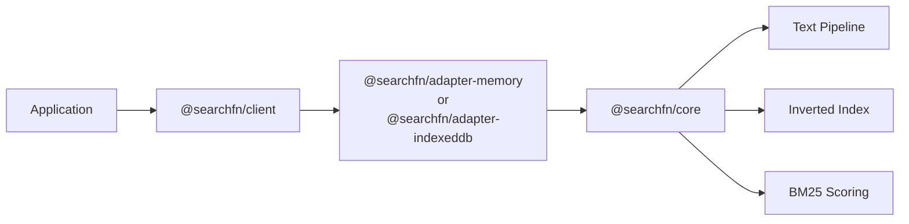

`@searchfn/core` is a complete in-process search engine. It's what makes the Memory and IndexedDb adapters production-ready rather than thin wrappers. If you're picking SearchFn over a third-party library, this is the part that has to hold up — so it's documented in detail.

## What's in the box

- **Text pipeline** — tokenize, normalize, stop words, stem, edge n-grams.
- **Inverted index** — postings keyed by `field::term`, with term frequency.
- **BM25 scoring** — IDF + TF + length norm + prefix penalty.
- **Fuzzy matching** — Wagner-Fischer Levenshtein with vocabulary pre-filter.
- **Field boosts** — per-field relevance weights at query time.

## Where it lives in the stack

The adapters own storage; the core owns search logic. This split is why Memory and IndexedDb are interchangeable from the application's perspective.

## When you'll touch the core directly

Mostly never. Adapters expose all the engine knobs through their constructors. The reason to read the deep-dive is:

- Tune ranking when relevance feels off
- Add a custom tokenizer for a non-supported language
- Understand the constants in `bm25.ts` before you start filing perf issues
- Build a new adapter that uses `@searchfn/core` against a custom storage layer

## Read order

1. [Text pipeline](/docs/documentation/core/pipeline) — what happens to text before indexing
2. [Inverted index](/docs/documentation/core/inverted-index) — how postings are stored and read
3. [BM25](/docs/documentation/core/bm25) — the scoring formula and its constants
4. [Fuzzy](/docs/documentation/core/fuzzy) — how fuzzy expansion works and what it costs
5. [Customization](/docs/documentation/core/customization) — hooks for replacing pipeline stages

## See also

- [Architecture](/docs/architecture)
- [Memory adapter](/docs/reference/adapters/memory)
- [IndexedDB adapter](/docs/reference/adapters/indexeddb)
