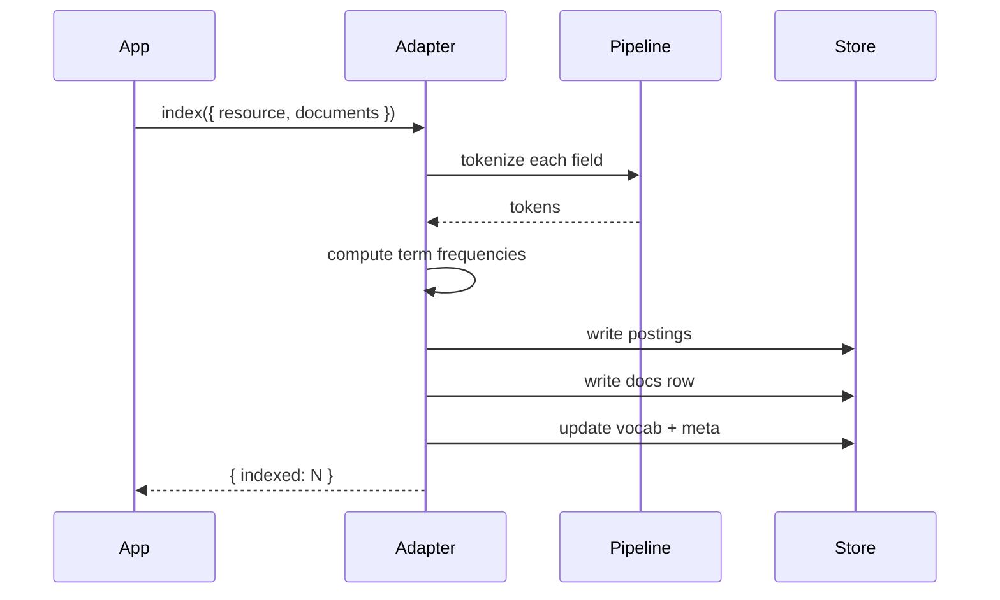
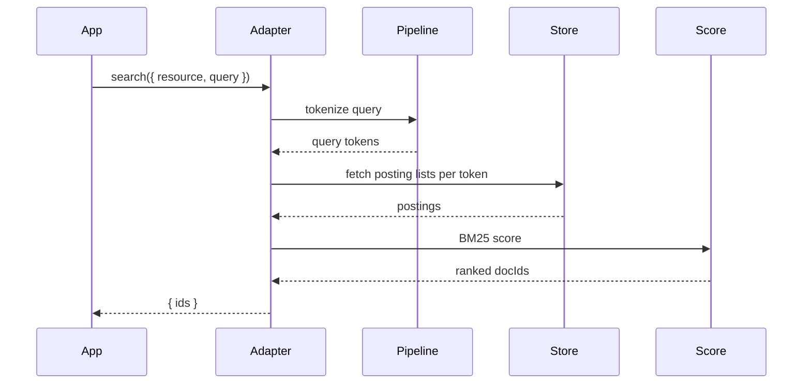

The inverted index is the core data structure. Conceptually it's `Map<term, Posting[]>` where a `Posting` is `{ docId, termFrequency }`. The two built-in adapters store this map differently — but the engine on top is the same.

## In-memory layout (`MemoryAdapter`)

```typescript
type MemoryIndex = {
  // field::term -> docId -> termFrequency
  postings: Map<string, Map<string, number>>;
  // docId -> field -> length (in tokens)
  docLengths: Map<string, Map<string, number>>;
  // field -> average length
  avgFieldLength: Map<string, number>;
  // field::term -> document count
  docFrequency: Map<string, number>;
};
```

Lookups are O(1) for hot paths (`field::term` → posting list). The map keys carry the field name so multi-field search is a sequence of map lookups.

## IndexedDB layout (`IndexedDbAdapter`)

IndexedDB uses object stores instead of in-memory maps:

| Store | Key | Value |
| --- | --- | --- |
| `postings` | `field::term::docId` | `termFrequency` |
| `docs` | `docId` | `{ field -> length, fields -> raw }` |
| `vocab` | `field::term` | `docFrequency` |
| `meta` | `resource` | `{ avgFieldLength, docCount }` |

Lookups go through an LRU cache (configurable) before hitting IndexedDB. Default cache size is 1024 terms — for hot queries this means everything is in memory after warm-up.

```typescript
new IndexedDbAdapter({
  dbName: "search",
  cache: {
    terms: 4096,   // hot term docFrequency
    postings: 8192, // hot posting lists
  },
})
```

## Why this matters

Postings dominate the storage footprint. A 1M-document corpus with average 50 tokens per document has roughly 50M postings. At 24 bytes per entry that's 1.2 GB — fine for a server, too big for a browser.

For browser-side IndexedDB:

- Trim what's indexed. Only fields you actually search.
- Use shorter fields (titles, not full bodies) when possible.
- Disable edge n-grams unless you specifically need autocomplete.
- Consider hybrid local + remote (see the [recipe](/docs/recipes/hybrid-local-remote)).

## Write path



Indexing is batched. Within a single `index({ documents })` call, postings are computed in memory and written in a single transaction (for IndexedDb) or set of map mutations (for Memory).

## Read path



## Updates and deletes

There's no "update posting" operation. A re-index of the same `docId` removes the old postings (using `docs` row metadata to know which terms to remove) and writes the new ones in a single batch.

A delete is symmetric: walk the doc's `field -> tokens` map, decrement each posting and remove the doc row.

## Vocabulary growth

The vocab grows with unique terms. For a corpus with diverse user-generated content this can be enormous (tens of millions of unique tokens). For controlled vocabularies (product names, fixed enums) it's small.

If your vocab is unbounded and dominated by typos / one-off terms, consider:

- A minimum-frequency filter (drop terms that appear in fewer than N documents).
- An ASCII fold normalize stage to merge `café` and `cafe`.
- A stricter tokenizer (e.g. drop tokens shorter than 3 characters).

## See also

- [BM25](/docs/documentation/core/bm25)
- [Cache tuning](/docs/documentation/performance/cache-tuning)
- [IndexedDB adapter](/docs/reference/adapters/indexeddb)
