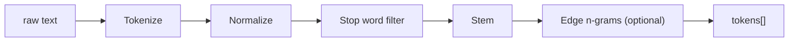

Every document field and every query string passes through the same pipeline. Symmetric processing is what makes ranking comparable — if `"running"` becomes `["run"]` at index time, the query `"running"` also has to become `["run"]` to match.

## Stages



1. **Tokenize** — `[\p{L}\p{N}]+` Unicode-aware regex. Splits on punctuation, whitespace, symbols.
2. **Normalize** — lowercase everything. (No diacritic folding by default; see [Customization](/docs/documentation/core/customization).)
3. **Stop words** — drop common words. Built-in lists for English, Spanish, French.
4. **Stem** — reduce to root form. Built-in English stemmer (a port of the Porter algorithm); off for other languages by default.
5. **Edge n-grams** — generate prefix tokens for autocomplete. Only added at index time, scored with a 0.7x penalty at query time.

## Configurability

```typescript
import { MemoryAdapter } from "@searchfn/adapter-memory";

const adapter = new MemoryAdapter({
  pipeline: {
    tokenize: customTokenizer,
    normalize: (token) => token.toLowerCase().normalize("NFD").replace(/[\u0300-\u036f]/g, ""),
    stopWords: new Set(["the", "and", "of"]),
    stem: porterStemmer,
    edgeNgrams: { min: 2, max: 8 },
  },
});
```

Any stage can be replaced. Pass `null` to skip a stage entirely.

## Per-language stop words

```typescript
const adapter = new MemoryAdapter({
  stopWords: {
    en: englishStopWords,
    es: spanishStopWords,
    fr: frenchStopWords,
  },
});
```

The active language can be set per-resource at `initialize()` time or per-query.

## Stemmer caveats

The built-in stemmer is English-only. It's conservative — it won't over-stem ("organization" stays distinct from "organize") but it gets the common verb forms (`running` → `run`, `searched` → `search`).

For non-English stemming, plug in a third-party stemmer:

```typescript
import { snowball } from "snowball-stemmers";

const adapter = new MemoryAdapter({
  pipeline: {
    stem: (token, lang) => snowball(lang ?? "english", token),
  },
});
```

## Edge n-grams (autocomplete)

When enabled, indexing `"searchfn"` produces tokens for `s`, `se`, `sea`, `sear`, ... `searchfn`. A query of `"sear"` then matches.

Cost: index size grows roughly with token length. A token of length 8 produces 7 extra postings. For a typical title-only resource this is fine; for long-body resources turn edge n-grams off.

Edge n-gram matches are scored with a 0.7x penalty so an exact match outranks a prefix match.

## Symmetric vs asymmetric

By default the pipeline runs symmetrically (same stages for index and query). For some use cases you want asymmetry — e.g. edge n-grams only at index time, not at query time. That's the default for `edgeNgrams`. For full control:

```typescript
const adapter = new MemoryAdapter({
  pipeline: {
    indexStages: ["tokenize", "normalize", "stopWords", "stem", "edgeNgrams"],
    queryStages: ["tokenize", "normalize", "stopWords", "stem"],
  },
});
```

## What's not in the pipeline

- Synonym expansion — provide a query-rewriter before calling `search()`.
- Spelling correction — fuzzy matching handles small typos; for richer correction wire in a dedicated service.
- Phrase preservation — exact-phrase support is on the roadmap.

## See also

- [Inverted index](/docs/documentation/core/inverted-index)
- [Customization](/docs/documentation/core/customization)
- [Multi-language recipe](/docs/recipes/multi-language)
