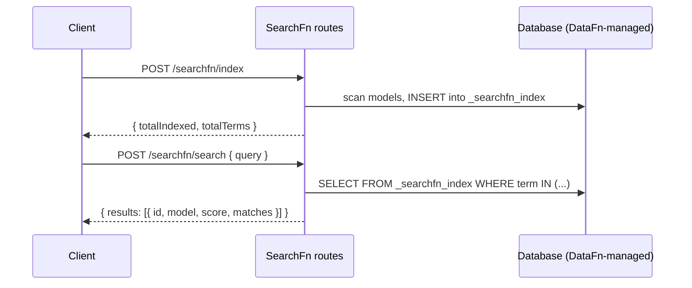

The Python package (`searchfn`) is a companion plugin for **DataFn Python**. It maintains an inverted index inside the same database DataFn uses, and exposes index / search operations as HTTP handlers and async functions.

It is **not** a full port of the TypeScript engine. The Python flavor targets:

- Quick prototyping with DataFn Python.
- Moderate-scale apps (tens to hundreds of thousands of records).
- Environments where adding Elasticsearch is overkill.

For everything else, run the TypeScript server (it's framework-agnostic and works across stacks).

## Two surfaces

| Surface | What it does |
| --- | --- |
| `create_searchfn_server` | Returns route handlers you mount on FastAPI, Flask, Starlette, etc. |
| `index_data` / `search_index` | Async functions for direct use in background jobs and tests. |

## How it works



The index is a single table named `<prefix>index` (default `_searchfn_index`) with columns `term, model, recordId, field`.

## Where it lives

```
searchfn/python/
  src/searchfn/
    __init__.py        ← public surface
    server.py          ← create_searchfn_server (HTTP handlers)
    indexing.py        ← index_data
    search.py          ← search_index
    utils.py           ← tokenize, schema helpers
```

## Sub-pages

- [Setup](/docs/documentation/python/setup) — install, configure, schema requirements.
- [Indexing](/docs/documentation/python/indexing) — `index_data` semantics.
- [Search](/docs/documentation/python/search) — `search_index`, scoring, limits.
- [HTTP mount](/docs/documentation/python/http-mount) — FastAPI, Starlette, Flask integration.

## See also

- [FastAPI quickstart](/docs/quickstart/fastapi)
- [Starlette quickstart](/docs/quickstart/starlette)
- [Flask quickstart](/docs/quickstart/flask)
- [Python reference](/docs/reference/python)
