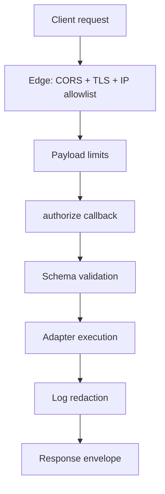

The short version: SearchFn assumes a hostile network and a partially-trusted client. The server is the single point of authorization. Adapters never see credentials; the server-side `authorize` callback is the gate.

## Layers

Each layer rejects the request as early as possible. Authorization happens before the adapter touches anything; validation happens before any work is queued.

## The trust model

| Component | Trusted? | Notes |
| --- | --- | --- |
| **Client** | No | Pass everything through the server |
| **Server router** | Yes | Validates and authorizes every request |
| **`authorize` callback** | Yes | Application code; you write it |
| **Adapter** | Yes | Receives only what `authorize` permits |
| **Backend** (Postgres, Meili, ES) | Yes | Credentials never leave the server |

There's no "direct client → backend" path. Clients hit the SearchFn server, which gates each operation.

## What's protected

- **Authentication** — your problem (use AuthFn or any session library).
- **Authorization** — the `authorize` callback. SearchFn enforces but doesn't decide policy.
- **Resource isolation** — naming convention + `authorize`. See [multi-tenant isolation](/docs/documentation/security/multi-tenant-isolation).
- **Input validation** — schema-checked request shapes; rejects malformed JSON, oversized payloads, invalid types.
- **Limit enforcement** — `maxQueryLength`, `maxIndexBatch`, etc. Per-server config.
- **Secret redaction** — `apiKey`, `password`, etc. are stripped from log output.

## What's not protected

SearchFn does not:

- Provide CSRF protection — that's your HTTP framework's job.
- Hash passwords — that's AuthFn's job.
- Encrypt at rest — that's your adapter's backend's job (Postgres, Meili, ES, IndexedDB).
- Encrypt in transit — that's TLS termination at your edge.

## Sub-pages

- [Request authz](/docs/documentation/security/request-authz) — the `authorize` callback in depth.
- [Multi-tenant isolation](/docs/documentation/security/multi-tenant-isolation) — keeping tenants apart.
- [Payload limits](/docs/documentation/security/payload-limits) — `maxQueryLength`, `maxIndexBatch`, and friends.
- [Secret redaction](/docs/documentation/security/secret-redaction) — what's stripped from logs.
- [Production checklist](/docs/documentation/security/production-checklist) — pre-launch audit.

## See also

- [Server reference](/docs/reference/server)
- [Multi-tenant search recipe](/docs/recipes/multi-tenant)
- [AuthFn integration](/docs/recipes/authfn-integration)
