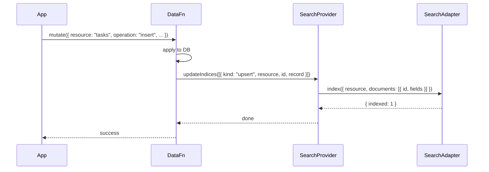

The reference page covers the API; this page covers the choices. If you're building DataFn + SearchFn together, you'll be making decisions about where the index lives, who owns indexing, and how multi-topology apps handle search.

## The provider boundary

`@searchfn/datafn-provider` exposes a single function:

```typescript
import { createSearchProvider } from "@searchfn/datafn-provider";

const provider = createSearchProvider(adapter, {
  resourceFields: {
    tasks: ["title", "description"],
    notes: ["content"],
  },
});
```

The provider implements DataFn's `SearchProvider` interface:

| DataFn calls | Provider does |
| --- | --- |
| `initialize(resources)` | Forwards to `adapter.initialize` |
| `search({ resource, query, ... })` | Forwards to `adapter.search` |
| `searchAll({ query, resources, ... })` | Native `searchAll` or merged per-resource |
| `updateIndices(mutations)` | For upserts → `adapter.index`. For deletes → `adapter.remove`. |
| `clearIndices(resource)` | Forwards to `adapter.clear` before a full DataFn index rebuild. |
| `dispose()` | Forwards to `adapter.dispose` |

## Server-side setup

```typescript
import { createDatafnServer } from "@datafn/server";
import { createSearchProvider } from "@searchfn/datafn-provider";
import { PostgresAdapter } from "@searchfn/adapter-postgres";

const provider = createSearchProvider(
  new PostgresAdapter({ connectionString: process.env.SEARCH_DB_URL! }),
  { resourceFields: { tasks: ["title", "description"] } }
);

const server = await createDatafnServer({
  schema,
  db: drizzleAdapter({ db, dialect: "postgres" }),
  search: provider,
});
```

Every DataFn mutation now calls `updateIndices` on the provider. Search calls flow through the same path.

## Client-side setup (browser-owned)

```typescript
import { createDatafnClient } from "@datafn/client";
import { createSearchProvider } from "@searchfn/datafn-provider";
import { IndexedDbAdapter } from "@searchfn/adapter-indexeddb";

const searchProvider = createSearchProvider(
  new IndexedDbAdapter({ dbName: "app-search" }),
  { resourceFields: { tasks: ["title", "description"] } }
);

const client = createDatafnClient({
  schema,
  clientId,
  storage,
  searchProvider,
});
```

`client.search(...)` now executes locally against IndexedDB by default, falling back to the server when local isn't ready.

## Native-backed (Apple WebView) setup

When the same web client runs inside a WebView with Swift-owned persistence, the local IndexedDB is wrong — you want the native SearchFn.

```typescript
import {
  createNativeBackedSearchProvider,
  createWKWebViewBridgeBus,
} from "@datafn/swift-bridge";

const bus = createWKWebViewBridgeBus({ handlerName: "datafn" });

const client = createDatafnClient({
  schema,
  clientId,
  storage: createNativeBackedStorageAdapter(bus),
  searchProvider: createNativeBackedSearchProvider(bus),
});
```

The native search provider proxies all `search` / `updateIndices` calls through the Swift bridge to the host runtime.

## Mutation → index pipeline



If `updateIndices` throws, the DataFn mutation **does not** roll back — DataFn's data is authoritative. The index lags briefly until a retry. Provider implementations should be idempotent (re-running `index` for the same ID with the same fields is safe).

## resourceFields fallback

When `resourceFields` is omitted for a resource, the provider indexes all fields except `id`. This is convenient for prototyping; for production, declare `resourceFields` explicitly — it prevents accidental indexing of sensitive fields (`passwordHash`, `apiKey`).

## Where ranking lives

When the client and server both have a SearchFn-backed provider, you can pick where search runs:

- **`source: "local"`** — IndexedDB-only; instant; may miss new data.
- **`source: "remote"`** — server search; always current; needs a network round-trip.
- **`source: "auto"`** (default) — local first; remote fallback.

See [DataFn's search docs](https://datafn.21n.co/docs/dfql/search) for the source toggle.

## Multi-tenancy

DataFn's namespaceProvider scopes data per tenant; the SearchFn provider follows. Each tenant's records are indexed into the same physical adapter, but DataFn filters by namespace before returning results.

For strict cross-tenant isolation (regulated industries), wrap the adapter to encode namespace into the resource name:

```typescript
const provider = createSearchProvider(adapter, {
  resourceFields: { tasks: ["title"] },
  resourceMapper: (resource, namespace) => `${resource}:${namespace}`,
});
```

(Roadmap — confirm support in your version.)

## See also

- [DataFn integration reference](/docs/integrations/datafn)
- [Multi-tenant search](/docs/recipes/multi-tenant)
- [Apple WebView bridge](https://datafn.21n.co/docs/documentation/apple/webview-bridge)
